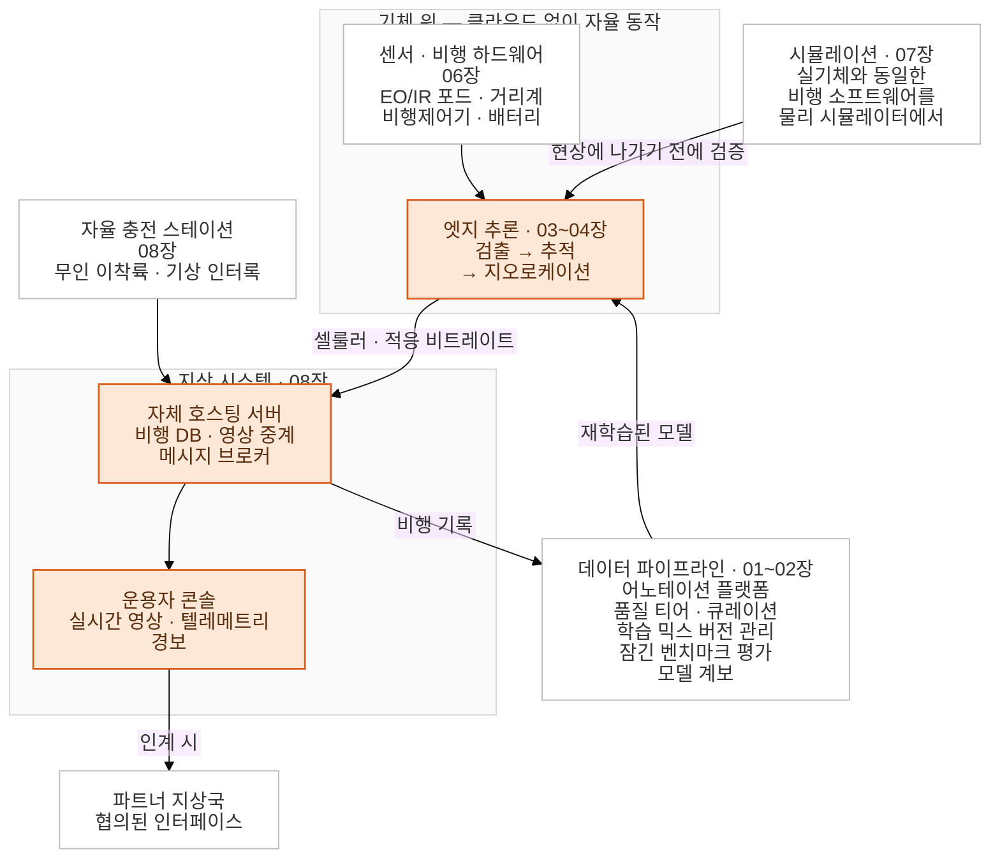

# 작업 · 연구 기록
엔지니어링과 연구 작업을 정리해둔 저장소. 본문은 산불 감시 드론 프로그램이고, 퀀트 리서치 ·
시뮬레이션과 강화학습 · 수학 연구는 [그 밖의 작업](#️-그-밖의-작업)에 별도 트랙으로 두었습니다.

**Language:** [English](./README.md) | 한국어

# 산불 감시를 위한 엣지 AI · 로보틱스 인프라

원격지 현장 조건에서 산불을 실시간으로 감지하기 위해 만든 엔드투엔드 저지연 시스템입니다.
**로보틱스 소프트웨어**(센서·제어·임베디드), **Vision AI**(모델 선정부터 엣지 배포까지),
**배포·운영**(검증·인프라·무인 현장 운용)에 걸쳐 있습니다.

> **🔒 NDA 및 독점 코드 안내:** 비밀유지계약(NDA) 준수를 위해 독점 소스코드, 내부 시스템 지표,
> 고객사 정보, 현장 위치 데이터는 제외했습니다. 이 저장소는 아키텍처, 엔지니어링 트레이드오프,
> 의사결정 과정을 다루는 기술 케이스 스터디입니다.

---

## 🔭 프로젝트 개요

산불은 초기에 잡을수록 피해가 작습니다. 그런데 불이 나는 산악 지형은 감지 조건이 좋지 않습니다.
가시선이 막히는 능선, 셀룰러 신호가 약한 지역, 전원이 없는 현장입니다.

그래서 기체가 무인 스테이션에서 자동으로 이륙해, 클라우드를 거치지 않고 **기체 위에서** 화재와
연기를 검출하고, 그 검출을 지도 좌표로 변환한 뒤, 회선이 감당하는 만큼의 대역폭으로 운용자에게
경보를 전달하는 구조로 만들었습니다.

| | |
| :--- | :--- |
| **문제** | 산악 지형에서의 초기 산불 골든타임 경보 |
| **접근** | 클라우드 의존 없는 기체 위 검출, 무인 이착륙, 좌표가 붙은 경보를 운용자 콘솔로 |
| **제약** | 약하고 변동이 큰 셀룰러 회선 · 엣지 노드의 고정된 전력·지연 예산 · 24/7 무인 야외 운용 · false negative는 곧 미신고 화재 |
| **규모** | 운용 기체 5대, 무인 스테이션 4기. 인지 스택은 라벨 한 장 없는 상태에서 실기체 배포까지 약 3개월 반 |
| **단계** | PoC. 설계 대상인 산악 지형이 아니라, 평지 개활지 테스트 사이트에 설치해 무인으로 운용 중 |
| **결과** | 엔드투엔드 현장 테스트 완료, 이후 공개 라이브 시연 |

이 저장소는 그 과정의 **의사결정 기록**입니다. 만들어서 측정한 뒤 기각한 경로도 채택한 경로와
같은 비중으로 적었습니다.

---

## 🏗️ 시스템 구조

*앰버로 표시한 것이 화재 경보가 센서에서 운용자까지 실제로 지나가는 경로입니다. 나머지는 그 경로를
유지하기 위한 구성 요소입니다. 스테이션은 무인 운용을, 시뮬레이터는 현장에 나가기 전 검증을,
데이터 루프는 검출기의 재학습을 담당합니다.*

---

## 👤 범위와 기여

이 저장소는 이 프로젝트의 인지·데이터·엣지·지상 시스템 스택 전반에서 제가 담당한 작업을 다룹니다.
모델 선정부터 현장 배포까지입니다. 이 프로젝트에서 **기술 쪽 프로젝트 매니저**도 맡았기 때문에
담당 범위가 스택 전반에 걸쳐 있습니다.

다른 사람과 함께한 부분은 아래에 명시했습니다.

- **어노테이션 작업량은 대부분 제가 직접 했습니다.** 다만 엔지니어링 기여는 라벨링 자체가 아니라,
  여러 어노테이터에게 작업을 분배하고 결과를 병합하는 과정을 수작업이 아닌 자동으로 만들도록
  어노테이션 플랫폼을 커스터마이징한 부분입니다.
- **비행 운용은 혼자 한 것이 아닙니다.** 현장 테스트에는 조종사와 현장 인력이 함께했습니다.
- **작업은 사무실에서 끝나지 않았습니다.** 야외 현장에서 조종사·현장 인력과 함께 테스트하고
  배포했고, 마지막에는 공개 라이브 시연까지 진행했습니다.

이 절은 산불 감시 시스템에 한정된 이야기입니다. 다른 프로젝트에서 한 작업은 아래 [그 밖의 작업](#-그-밖의-작업)에 따로 정리해뒀습니다.

이 프로젝트는 제가 맡은 두 번째 단계이기도 합니다. 그 전에는 연구 쪽 업무였습니다. 최신 논문
재현, 3D 시뮬레이션 기반 강화학습, 클라우드 headless 병렬 학습 같은 작업입니다. 회사의 우선순위가
research에서 real-world deployment로 옮겨가면서 제 업무도 산불 감시로 이동했습니다. 앞 단계는
[시뮬레이션 · 강화학습](./simulation-rl/README.ko.md) 트랙에 정리해뒀습니다.

---

## 🧰 스택

| 영역 | 도구 |
| :--- | :--- |
| **언어** | Python, C++ |
| **인지 · 학습** | PyTorch, TensorRT, CUDA, OpenCV |
| **데이터 · 실험 관리** | CVAT (self-hosted, 포크), ClearML (self-hosted) |
| **로보틱스 · 비행** | ROS 2, ArduPilot, MAVLink, Mission Planner, QGroundControl, Gazebo, software-in-the-loop 시뮬레이션 |
| **임베디드 · 버스** | 커스텀 캐리어 보드 위의 Raspberry Pi CM4/CM5, I²C, GPIO, UART/시리얼, 릴레이 제어, ToF · 풍향풍속 · 강우 센서, 레이저 거리계, EO/IR 짐벌 포드 |
| **서버 · 데이터** | PostgreSQL, CloudBeaver, MQTT, RTSP, Docker, Linux |
| **관측성** | Grafana, 시계열 지표, 중앙 로그 수집, 경보 |
| **엣지 하드웨어** | NVIDIA Jetson Orin Nano, Raspberry Pi, Rockchip NPU |
| **클라우드** | GCP, AWS |
| **이전 단계** ([시뮬레이션 · 강화학습](./simulation-rl/README.ko.md)) | Unreal Engine, PyBullet, AirSim, MuJoCo, Isaac, Stable-Baselines3, Ray RLlib, Gaussian Splatting / SIBR |

---

## 📚 작업 내용

아홉 개 장은 검출기를 만들고, 기체에 올리고, 현장에 배포하는 순서로 이어집니다. 동시에 세 개의
엔지니어링 트랙으로 묶이며 각 트랙이 연속된 구간이라, 처음부터 읽어도 되고 한 트랙만 골라 읽어도
됩니다.

### 1 · Vision AI 엔지니어링 — 01~03장

검출기를 고르고, 학습 데이터를 만들고, 기체의 지연·전력 예산 안에서 돌아가게 만드는 작업입니다.
단일 strict 기준으로 채점한 15개+ 모델 서베이, 채점 기준 정비, 어노테이션 도구 커스터마이징,
그리고 구현해서 측정한 뒤 배포하지 않기로 한 INT8 양자화가 여기 들어갑니다.

| # | 챕터 | 다루는 내용 |
| :--- | :--- | :--- |
| 01 | [모델 선정 & 평가 방법론](./wildfire-uav/ko/01-model-selection.md) | 15개+ 모델 서베이, 리더보드를 뒤집은 그레이더 교정, open-vocab 실패 메커니즘 |
| 02 | [데이터 파이프라인 & 어노테이션](./wildfire-uav/ko/02-data-pipeline.md) | 티어별 라벨링, 어노테이션 플랫폼 포크, 감사 가능한 큐레이션, ML 파이프라인 |
| 03 | [엣지 최적화](./wildfire-uav/ko/03-edge-optimization.md) | INT8 검증과 기각, 캐스케이드 추론, 1,024 파라미터 적응 |

### 2 · 로보틱스 소프트웨어 엔지니어링 — 04~06장

검출 결과와 실제 기체 사이를 잇는 작업입니다. 검출기에서 짐벌까지 제어 루프를 닫고, 프레임 속
박스를 지도 좌표로 변환하고, 그 아래 하드웨어가 정확한 값을 보고하게 만드는 일입니다. 센서,
비행제어기 통합, 배터리 모니터링, 벤더 카메라, 그리고 엣지 디바이스가 운용 가능해지기까지의
시간이 여기 들어갑니다.

| # | 챕터 | 다루는 내용 |
| :--- | :--- | :--- |
| 04 | [실시간 인지 & 제어](./wildfire-uav/ko/04-realtime-control.md) | 짐벌 폐루프 추적, SDK contention, 증거 수집, 운용 범위 |
| 05 | [센서 · 신호처리 · 시간 동기화](./wildfire-uav/ko/05-geometry-sensors.md) | 교차상관 기반 영상↔비행로그 정렬, 여러 시계 위에 시간축 세우기, 커버리지 경로계획 |
| 06 | [하드웨어 & 인터페이스 통합](./wildfire-uav/ko/06-hardware-integration.md) | 배터리 모니터 결함, USB 포트를 태운 접지 루프, 비행제어기 통합, 부팅 시간 |

### 3 · 배포 · 운영 — 07~08장

불 없이 시스템을 검증하고, 테스트 사이트에서 무인으로 운용되게 만드는 작업입니다. 실제 기체와
동일한 온보드 소프트웨어를 돌리는 시뮬레이터, 임베디드 리눅스 기반 자율 충전 스테이션, 운용자
콘솔, 자체 호스팅 서버 플랫폼, 그리고 셀룰러 회선 대응이 여기 들어갑니다.

| # | 챕터 | 다루는 내용 |
| :--- | :--- | :--- |
| 07 | [시뮬레이션 & 검증](./wildfire-uav/ko/07-simulation-verification.md) | 실제 지형 모델 위에서의 커버리지 검증, 제어 체인 검증용 합성 검출기, 정답 라벨 없는 시커 평가 프레임워크 |
| 08 | [현장 인프라 & 운영](./wildfire-uav/ko/08-infrastructure.md) | 자율 충전 스테이션, 직접 구축한 지상국(GCS), 비행·로그 분석, 무중단 DB 마이그레이션 |

### 연구 트랙 — 09장

open-vocabulary 검출기가 amorphous class(연기, 안개, 기둥)에서 실패하는 방식에 대한 메커니즘
수준의 발견 다섯 가지입니다. 연구 과제로 진행한 것이 아니라 제품을 만드는 과정에서 나온 결과이고,
논문화에 필요한 실험 목록까지 함께 적었습니다.

| # | 챕터 | 다루는 내용 |
| :--- | :--- | :--- |
| 09 | [연구 기여](./wildfire-uav/ko/09-research-contributions.md) | Open-vocabulary 검출기 실패 메커니즘 5종과, 논문화에 필요한 조건 |

> 각 챕터는 영문판과 한글판을 함께 유지합니다. 문서 상단에서 전환할 수 있습니다.

---

## 📊 핵심 트레이드오프

기각한 경로도 채택한 경로만큼 상세히 기록했습니다. 대표적인 예가 아래입니다. 배포 결정 전에 두
가지 post-training 최적화 경로를 모두 측정했습니다.

| 전략 | 지연 | 정확도 | 상태 |
| :--- | :--- | :--- | :--- |
| **베이스라인 파이프라인** | 기준 | 기준 | 평가 완료 |
| **INT8 양자화** (SmoothQuant + 선택적 FP16 fallback) | 가장 빠름 | **상한이 FP16에 못 미침** | **검증 후 기각** |
| **FP16 + GPU 전/후처리** | **베이스라인 대비 −37%** | **측정 가능한 손실 없음** | **채택 · 배포** |

가장 공격적인 양자화 옵션을 기본값으로 택하는 대신, 지연이 실제로 어디서 발생하는지를 먼저
측정했습니다. 수치 표현 방식이 아니라 전/후처리였고, 그 결과 **정확도 손실 없이 엔드투엔드 지연을
37% 줄였습니다.** 미검출이 곧 미신고 화재가 되는 시스템에서는 이 구분이 의사결정 기준이 됩니다.

---

## 🚀 핵심 성과
- AI 모델과 실제 엣지 하드웨어 사이를 엔드투엔드로 연결.
- 오프라인·자원 제약 환경에서 돌아가는 프로덕션 수준 엣지 인프라를 배포.

---

## 🗂️ 그 밖의 작업

이 저장소의 본문은 산불 감시 시스템을 다룹니다. 그 앞뒤로 별개 프로젝트에서 했던 작업도 같은
저장소에 정리해 두었습니다.

| 영역 | 문서 | 다루는 내용 |
| :--- | :--- | :--- |
| **퀀트 리서치** | [수익률 예측 피처 · 부스팅 모델 구조 수정](./quant-research/README.ko.md) | 추세 일관성 피처의 정의와 검증, 시계열 워크포워드 설계, XGBoost 구조 수정, 개선과 과적합을 구분하는 방법 |
| **시뮬레이션 · 강화학습** | [드론 자율성: 시뮬레이션, 강화학습, 3D 비전](./simulation-rl/README.ko.md) | 클라우드 headless로 학습시킨 멀티에이전트 RL 편대 제어, 밑바닥부터 재현한 2025년 논문, 거리 변환 회피와 검출 기반 유도 (3개 장) |
| **수학 연구** | [정수론 · p-adic 기하](./mathematics/README.ko.md) | 아핀 들리뉴–루스티그 다양체, 시무라 다양체, 랭글랜즈 프로그램 *(작성 중)* |
