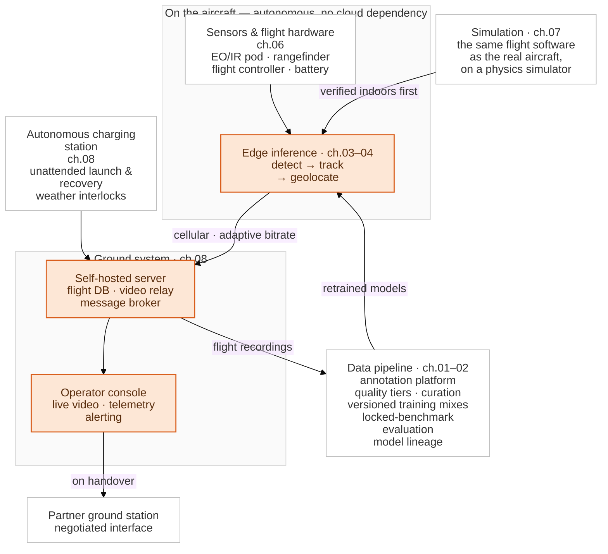

# Work & Research Log
A record of engineering and research work. The body of this repository is a wildfire
surveillance drone program; quantitative research, simulation and reinforcement learning, and
mathematics each sit in their own track under [Other Work](#️-other-work).

**Language:** English | [한국어](./README.ko.md)

# Edge AI & Robotics Infrastructure for Wildfire Surveillance

An end-to-end, low-latency system engineered to detect wildfires in real time under remote-field
constraints — spanning **robotics software** (sensors, control, embedded), **vision AI** (model
selection through edge deployment), and **deployment & operations** (verification,
infrastructure, unattended field operation).

> **🔒 Note on NDA & Proprietary Code:** To comply with non-disclosure agreements, proprietary
> source code, internal system metrics, client identities, and site-specific data have been
> omitted. This repository is a technical case study of the architecture, engineering
> trade-offs, and decision-making process.

---

## 🔭 Overview

A wildfire is cheapest to stop in its first minutes, and the terrain where fires start is the
terrain where detecting them is hardest: ridgelines with no line of sight, weak and uneven
cellular coverage, and no power at the site. The answer this project built was an aircraft that launches
itself from an unattended station, detects fire and smoke **on board** with no cloud round-trip,
converts a detection into a map coordinate, and gets an alert to a human over whatever cellular
capacity the link actually has that minute.

| | |
| :--- | :--- |
| **Problem** | Golden-time alerting for early-stage wildfire in mountainous terrain |
| **Approach** | On-aircraft detection with no cloud dependency, unattended launch and recovery, geolocated alerts to an operator console |
| **Hard constraints** | Weak, fluctuating cellular coverage · a fixed power and latency budget on the edge node · 24/7 unattended outdoor operation · a false negative means an unreported fire |
| **Scale** | Five operational aircraft, four unattended stations; the perception stack went from no labeled data to a detector deployed on the aircraft in about three and a half months |
| **Stage** | Proof of concept. The system is installed and operating unattended at a flat open test site, not yet on the mountain terrain it is designed for |
| **Outcome** | Field-tested end to end, followed by a public live demonstration |

What this repository documents is the **decision record** behind that — including the paths that
were built, measured, and then rejected, which are written up as carefully as the ones that
shipped.

---

## 🏗️ System Architecture

*Amber marks the path a fire alert actually travels, sensor to operator. Everything else exists
to keep that path working — the station so the aircraft flies unattended, the simulator so
defects are found indoors, and the data loop so every flight improves the detector that flew it.*

---

## 👤 Scope & Attribution

This documents work I was responsible for across the perception, data, edge and
ground-system stack of this project — model selection through field deployment. I also served
as the **technical project manager** on the project, which is why a single account spans this
much of the stack.

Where effort was shared, it is named as such:

- **Annotation labour was largely mine.** The engineering contribution was not the labelling
  itself but customizing the annotation platform so that distributing work across multiple
  annotators, and merging their output, became automatic instead of manual.
- **Flight operations were not solo** — field tests involved pilots and site staff.
- **The work did not stop at the office.** Testing and deployment happened on site, outdoors,
  alongside pilots and field staff, with a public live demonstration at the end.

This section is about the wildfire surveillance system only. Work from separate projects is
collected under [Other Work](#-other-work) below.

This was also the second phase of the role. The first was research-side: reproducing recent
papers, reinforcement learning in 3D simulation, headless parallel training in the cloud. My
work moved to wildfire surveillance when the company's priority shifted from research to
real-world deployment. That earlier phase is written up in the
[Simulation & RL](./simulation-rl/README.md) track.

---

## 🧰 Stack

| Area | Tools |
| :--- | :--- |
| **Languages** | Python, C++ |
| **Perception & training** | PyTorch, TensorRT, CUDA, OpenCV |
| **Data & experiments** | CVAT (self-hosted, forked), ClearML (self-hosted) |
| **Robotics & flight** | ROS 2, ArduPilot, MAVLink, Mission Planner, QGroundControl, Gazebo, software-in-the-loop simulation |
| **Embedded & buses** | Raspberry Pi CM4/CM5 on a custom carrier board, I²C, GPIO, UART/serial, relay control, ToF / anemometer / rain sensors, laser rangefinder, EO/IR gimbal pod |
| **Server & data** | PostgreSQL, CloudBeaver, MQTT, RTSP, Docker, Linux |
| **Observability** | Grafana, time-series metrics, centralized log collection, alerting |
| **Edge hardware** | NVIDIA Jetson Orin Nano, Raspberry Pi, Rockchip NPU |
| **Cloud** | GCP, AWS |
| **Earlier phase** ([Simulation & RL](./simulation-rl/README.md)) | Unreal Engine, PyBullet, AirSim, MuJoCo, Isaac, Stable-Baselines3, Ray RLlib, Gaussian Splatting / SIBR |

---

## 📚 The Work

Nine chapters, ordered as one narrative: a detector that works, on an aircraft, in a field.
They also group into three engineering tracks, each a contiguous block — so this reads straight
through, or one track at a time.

### 1 · Vision AI Engineering — chapters 01–03

Choosing a detector, building the data that trains it, and making it run inside an aircraft's
latency and power budget. A 15+ model survey scored on one strict grader, a grader fix that
inverted the leaderboard, a forked annotation platform, and the most aggressive optimization
available implemented, measured, and deliberately not shipped.

| # | Chapter | Topics |
| :--- | :--- | :--- |
| 01 | [Model Selection & Evaluation Methodology](./wildfire-uav/01-model-selection.md) | 15+ model survey, the grader fix that inverted the leaderboard, open-vocab failure mechanisms |
| 02 | [Data Pipeline & Annotation](./wildfire-uav/02-data-pipeline.md) | Tiered labeling, forking the annotation platform, auditable curation, the ML pipeline |
| 03 | [Edge Optimization](./wildfire-uav/03-edge-optimization.md) | INT8 investigation and rejection, cascade inference, 1,024-parameter adaptation |

### 2 · Robotics Software Engineering — chapters 04–06

Everything between a detection and a physical aircraft: closing the loop from detector to
gimbal, turning a box in frame into a map coordinate, and making the hardware underneath report
the truth. Sensors, flight controller integration, battery monitoring, vendor cameras, and the
time it takes an edge device to become operational.

| # | Chapter | Topics |
| :--- | :--- | :--- |
| 04 | [Real-Time Perception & Control](./wildfire-uav/04-realtime-control.md) | Gimbal closed-loop tracking, SDK contention, evidence capture, operating envelope |
| 05 | [Sensors, Signal Processing & Time Sync](./wildfire-uav/05-geometry-sensors.md) | Video↔flight-log alignment by cross-correlation, a time axis across many clocks, coverage path planning |
| 06 | [Hardware & Interface Integration](./wildfire-uav/06-hardware-integration.md) | Battery monitor faults, a ground loop that damaged hardware, flight controller integration, boot time |

### 3 · Deployment & Operations — chapters 07–08

Verifying the system without a fire, then keeping it running unattended at the test site. A
simulator running the same onboard software as the real aircraft, autonomous charging stations
on embedded Linux, an operator console, a self-hosted server platform, and handling a cellular
link that degrades.

| # | Chapter | Topics |
| :--- | :--- | :--- |
| 07 | [Simulation & Verification](./wildfire-uav/07-simulation-verification.md) | Coverage verification against real terrain models, synthetic detector for control verification, scoring a tracker with no ground truth |
| 08 | [Field Infrastructure & Operations](./wildfire-uav/08-infrastructure.md) | Autonomous charging stations, a ground station built in-house, flight and log analysis, zero-downtime database migration |

### Research track — chapter 09

Five mechanism-level findings about how open-vocabulary detectors fail on amorphous classes —
smoke, fog, plumes — produced as a byproduct of shipping rather than as a research project,
with the specific experiments that would turn them into a paper.

| # | Chapter | Topics |
| :--- | :--- | :--- |
| 09 | [Research Contributions](./wildfire-uav/09-research-contributions.md) | Open-vocabulary detector failure mechanisms — and what would be needed to publish them |

> Every chapter is maintained in English and Korean; switch at the top of any page.

---

## 📊 The Central Trade-off

Rejected paths are documented as carefully as the ones that shipped. The clearest example: both
major post-training optimization paths were measured before a deployment decision.

| Strategy | Latency | Accuracy | Status |
| :--- | :--- | :--- | :--- |
| **Baseline Pipeline** | Reference | Reference | Evaluated |
| **INT8 Quantization** (SmoothQuant + selective FP16 fallback) | Fastest | **Ceiling remained below FP16** | **Evaluated & Rejected** |
| **FP16 + GPU Pre/Post-processing** | **−37% vs. baseline** | **No measurable loss** | **Selected & Deployed** |

*Engineering impact:* a 37% end-to-end latency reduction **with no accuracy trade-off**, reached
by measuring where the latency budget actually went (pre/post-processing, not numeric precision)
instead of defaulting to the most aggressive quantization available. For a detector where a false
negative means an unreported fire, that distinction is the decision.

---

## 🚀 Key Takeaways
- Bridged theoretical AI models and rugged physical edge hardware, end to end.
- Delivered production edge infrastructure for offline, resource-constrained environments.

---

## 🗂️ Other Work

The body of this repository is the wildfire surveillance system. Work from separate projects,
before and alongside it, is collected here as well.

| Area | Document | Topics |
| :--- | :--- | :--- |
| **Quantitative research** | [A return-forecasting feature and structural changes to a boosted model](./quant-research/README.md) | Defining and validating a trend-consistency feature, walk-forward design on a time series, structural modifications to XGBoost, telling an improvement from an overfit |
| **Simulation & RL** | [Drone Autonomy: Simulation, Reinforcement Learning and 3D Vision](./simulation-rl/README.md) | Multi-agent RL formation control trained headless in the cloud, a 2025 paper reproduced from scratch, distance-transform avoidance and detection-driven guidance (three chapters) |
| **Mathematics** | [Number theory and p-adic geometry](./mathematics/README.md) | Affine Deligne–Lusztig varieties, Shimura varieties, the Langlands Program *(in progress)* |
