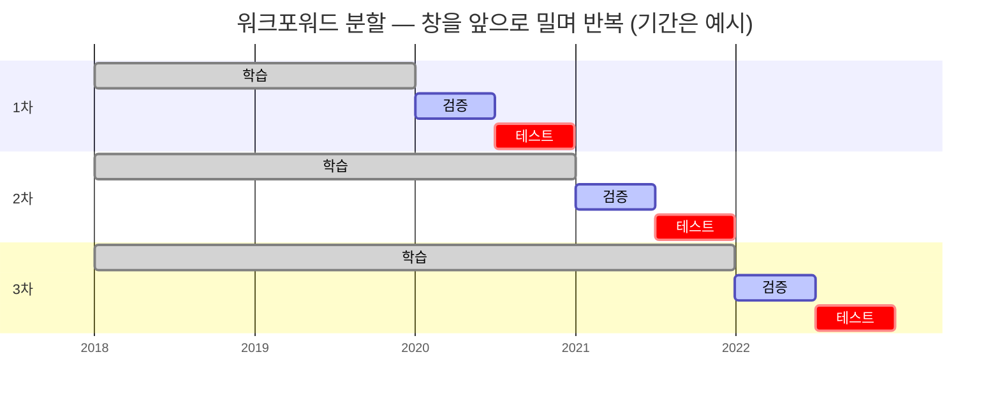

[← 개요로](../README.ko.md) · **Language:** [English](./README.md) | 한국어

# 퀀트 리서치 — 수익률 예측 피처 · 부스팅 모델 구조 수정

> **범위 안내.** 고용사·팀·상품명, 실제 운용 지표, 내부 코드는 제외함. 아래는 문제 정의와
> 방법론, 그리고 어떤 판단을 왜 내렸는지에 대한 기록. 이 내용의 바탕이 된 발표 슬라이드
> 자체는 저장소에 포함하지 않음.

---

## 맥락

주식 수익률 예측 모델을 개선하는 일이었음. 크게 두 갈래.

- **피처 엔지니어링** — 새 설명변수를 만들거나, 이미 있는 수백 개를 다시 활용하는 쪽
- **알고리즘 수정** — 학습·검증·테스트 설계, 하이퍼파라미터, 모델 구조 자체를 건드리는 쪽

예측이 전부는 아님. 그 예측으로 실제 주문을 내는 단계에서 유동성이나 자기 주문이 시장에 주는
영향 같은 것이 다시 걸림. 아래는 그중 예측 쪽에서 내가 맡았던 두 작업.

---

## 1. 추세 일관성 피처

**문제.** 기존 모멘텀 피처(RSI, MFI, CCI 등)는 대체로 "얼마나 움직였나"를 재는 양임. 그런데 같은
폭으로 오른 두 종목이라도 꾸준히 오른 것과 크게 출렁이며 오른 것은 다르게 다뤄야 함. 이 차이를
직접 재는 피처가 없었음.

**정의.** 일정 기간의 가격 경로에 추세선을 적합하고, 그 **적합의 설명력(R²)** 을 추세의 일관성으로
씀. 값이 크면 그 기간 동안 가격이 추세선 주변에서 크게 벗어나지 않았다는 뜻.

주의할 점이 하나 있음. 이 값은 **방향을 모름**. 꾸준히 내린 종목도 꾸준히 오른 종목과 똑같이 높은
값을 받음. 그래서 단독으로 쓰지 않고, 과거 수익률과 곱해서 부호를 붙이거나 이 값으로 종목을 나누고
순위를 매기는 방식으로 씀.

**설계 축.** 정의는 하나지만 선택지가 여러 겹으로 붙음. 축이 셋이라 조합 수만큼 변종이 생김.

| 축 | 선택지 |
| :--- | :--- |
| 적합 방식 | 단순 선형회귀 / 저차 다항회귀 (추세가 휘는 경우) |
| 가격 계열 | 원가격 / 이동평균 (노이즈 제거) / 주성분 제거 후 (공통 요인 제거) |
| 룩백 길이 | 단기부터 장기까지 |

**검증.** 새 피처는 만들었다고 바로 쓰는 게 아니라 시계열 분석부터 함.

- 기존 피처들과의 **롤링 상관** — 이미 있는 피처를 이름만 바꿔 다시 만든 건 아닌지 확인.
- 미래 수익률과의 **롤링 상관** — 히트맵과 히스토그램으로 봄. 전 구간 평균만 보면 시기에 따라
  부호가 뒤집히는 것을 놓침.

둘 다 "롤링"인 게 핵심. 한 시점에서 한 번 잰 상관은 우연일 수 있음.

**구현.** 연도를 인자로 받는 R 스크립트로 계산함. SQL로 2년치 데이터를 가져오고, 여러 종류의 R²를
계산하는 내부 함수를 정의한 뒤, fast-rolling 함수로 1년 윈도우 위에 적용. 파이썬 대응본도 만들어둠
(pandas + sklearn). 연도 단위로 독립이라 셸 스크립트로 병렬화.

---

## 2. Gradient boosting 구조 수정

### 시계열에서의 학습 / 검증 / 테스트

일반적인 분할은 데이터를 무작위로 셋으로 나눔. 시계열에서 그렇게 하면 미래를 보고 과거를 맞히는
셈이 됨. 대신 **워크포워드**로 감. `[학습 | 검증 | 테스트]` 창을 시간축에서 한 칸씩 밀면서, 각
구간마다 검증에서 최적 모델을 고르고 그 다음 구간을 테스트로 씀.

지켜야 하는 규칙은 하나. **어느 구간에서도 검증과 테스트가 학습보다 앞서지 않는 것.** 무작위
분할이 깨는 게 정확히 이 규칙이고, 그렇게 되면 성능이 좋아 보이는 이유가 모델이 아니라 미래를
본 것이 됨.

- **학습.** `f(X_train) ≈ y_train` 인 `f`를 찾음. `X`는 피처, `y`는 미래 수익률. XGBoost는 트리를
  순차적으로 만들면서 다음 트리가 지금까지 쌓인 오차를 보정하는 구조. 손잡이는 트리 개수, 트리
  깊이, 손실 함수 등.
- **검증.** 과적합을 막는 단계. 트리를 전부 쓰지 않고 early stopping을 함 (신경망의 epoch 수와
  비슷한 역할). 여기서 **어떤 메트릭을 쓰느냐가 곧 "좋다"의 정의**가 됨. L² 거리, L¹ 거리,
  상관 `f(X)·y / |f(X)||y|`, 부호 정확도 — 각각 다른 모델을 고름. 큰 손실을 피하는 게 중요하면
  L², 방향만 맞히면 되는 상황이면 부호 정확도.
- **테스트.** 메트릭별로 고른 `f₁, f₂, …` 를 선형결합해 예측을 만들고, 그 조합의 오차를 테스트
  구간에서 확인.

### 구조 수정

모델 자체를 건드리는 쪽. 두 가지를 함.

**종목을 그룹으로 나눠 따로 다루기.** 과거 수익률이나 위의 추세 일관성 같은 특성으로 종목을 묶음.
세 가지 안을 두고 비교했고, 뒤로 갈수록 자유도가 줄고 과적합 위험이 낮아짐.

1. 그룹별로 XGBoost를 완전히 따로 학습 — 자유도가 가장 크고 과적합 위험도 가장 큼
2. 학습은 따로 하되 트리 개수는 그룹 간 동일하게
3. 학습은 함께 하고, 그룹별로 쓰는 트리 개수만 다르게

**트리를 선택적으로 쓰기.** 부스팅은 앞쪽 트리가 큰 구조를 잡고 뒤쪽 트리가 잔차를 잡음. 전체를
다 쓰지 않고 구간을 골라 쓰거나 (예: 80~100번째만) 트리마다 가중치를 다르게 주는 것도 하나의
손잡이.

**구현.** 파이썬 XGBoost 코드를 직접 수정함. 설정 파일(yaml)에 그룹 같은 새 파라미터를 추가하고,
수천 줄짜리 코드베이스에서 해당 루프를 찾아 고침. 남이 쓴 코드에서 건드릴 지점을 찾는 일이 실제
수정보다 오래 걸렸음.

---

## 3. 개선인지 과적합인지 구분하기

시간이 지나면 알고리즘은 계속 갱신됨. 하이퍼파라미터가 바뀌고 구조가 바뀜. 문제는 **오차가
줄었다는 사실 자체가 개선의 증거가 되지 못한다**는 것. 지금까지 쌓인 데이터를 보면서 고쳐온
것이므로, 줄어든 오차 중 일부는 그냥 과거에 맞춘 결과임.

그래서 이렇게 확인함. 지금 제안하는 수정 X를 **과거 시점의 알고리즘 버전에 소급 적용**함. 그
시점에 X가 있었다면 이후 기간의 성능이 실제로 좋아졌을지를 봄. 지금 데이터에 맞춘 결과가 아니라
당시 기준으로 평가하는 것.

이 확인을 붙이면 "이번 수정으로 오차가 줄었다"와 "이 수정은 시점을 옮겨도 성립한다"가 서로 다른
주장이라는 게 드러남.

---

## 여기서 가져온 것

| 이 시기에 | 어디로 이어졌는가 |
| :--- | :--- |
| 평가 메트릭을 고르는 것이 곧 "좋다"의 정의라는 것 | [01 — 모델 선정 & 평가 방법론](../wildfire-uav/ko/01-model-selection.md) |
| 모델보다 검증 설계가 먼저라는 것 | [01 — 모델 선정 & 평가 방법론](../wildfire-uav/ko/01-model-selection.md) |
| 누수를 막는 데이터 분할 | [02 — 데이터 파이프라인 & 어노테이션](../wildfire-uav/ko/02-data-pipeline.md) |

---

[← 개요로](../README.ko.md)
