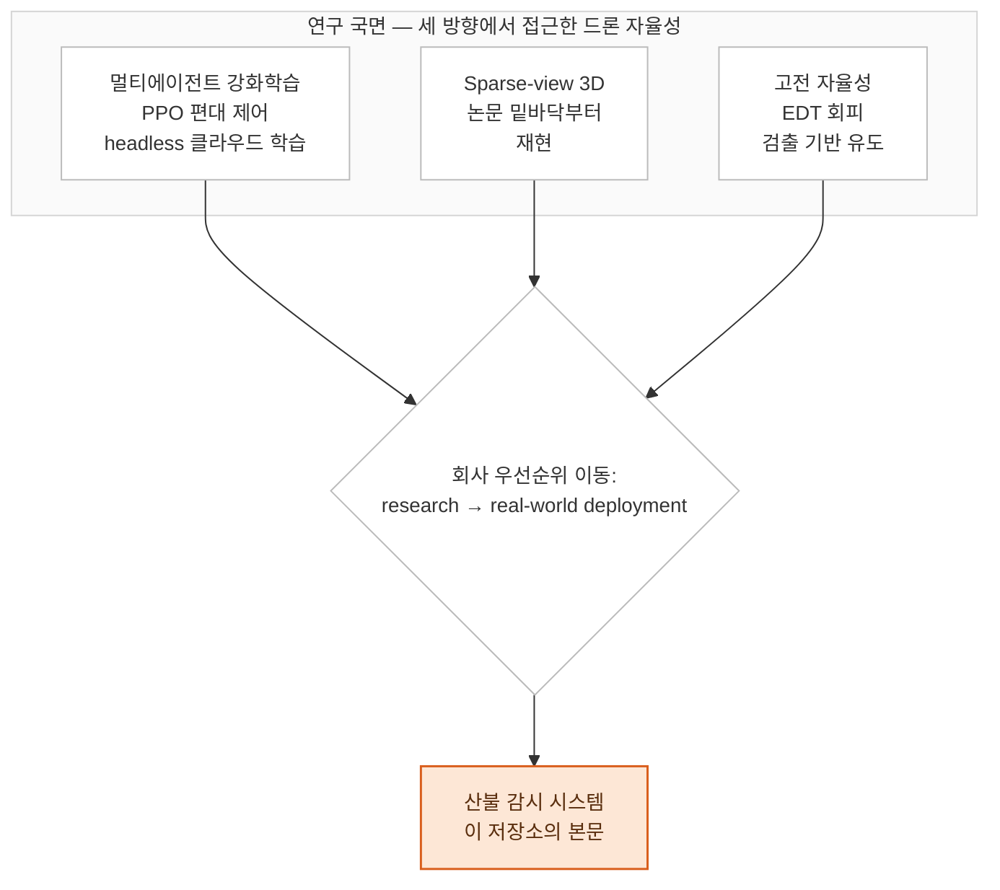

[← 개요로](../README.ko.md)

# 드론 자율성 — 시뮬레이션, 강화학습, 3D 비전

[케이스 스터디] 드론 자율성 작업 1년: 클라우드에서 headless로 학습시킨 멀티에이전트 강화학습,
밑바닥부터 재현한 2025년 논문, 그리고 그 옆에서 함께 굴린 고전적 회피·유도 스택.

**Language:** [English](./README.md) | 한국어

> **🔒 NDA 및 독점 코드 안내:** 독점 소스코드, 내부 지표, 고객사 정보, 현장 데이터는 제외했습니다.
> 접근 방식과 트레이드오프, 의사결정을 다루는 기술 케이스 스터디입니다. 오픈소스 도구와 공개된
> 논문은 실명으로 적었고, 그 외에는 적지 않았습니다.

---

## 이 문서는 무엇인가

드론 자율성 업무의 **연구 국면**을 다룹니다 — 이 저장소의 나머지가 다루는
[산불 감시 프로그램](../README.ko.md)에 앞선 1년의 작업입니다.

세 갈래가 나란히 돌아갔고, 각각 자율성이라는 문제를 정반대 방향에서 접근했습니다: **학습 기반**
(멀티에이전트 강화학습 편대 제어), **인지·복원 기반**(최신 sparse-view 3D 방법론 재현), 그리고
**고전 알고리즘 기반**(거리 변환 회피와 검출 기반 유도). 어느 것도 제품은 아닙니다. 초점이
좁혀지기 전에 이 문제를 어떤 각도들에서 공략했는지에 대한 지도에 가깝습니다.

**이 갈래가 멈춘 이유:** 소진되어서가 아닙니다. 회사의 우선순위가 research에서 real-world
deployment로 이동하면서 제 업무도 함께 옮겨갔고, 그 끝이 산불 감시 시스템입니다. 이 국면에서 얻은
시뮬레이션·"검출이 제어를 구동한다"·headless 인프라 경험은 거기서 그대로 쓰였습니다.

---

## 챕터

| # | 챕터 | 다루는 내용 |
| :--- | :--- | :--- |
| 01 | [멀티에이전트 강화학습 기반 편대 제어](./ko/01-multi-agent-rl.md) | 시뮬레이터 2종·RL 스택 2종 위의 PPO, 클라우드 headless 병렬 학습, 진짜 문제였던 보상 계수 탐색 |
| 02 | [논문 밑바닥부터 재현하기](./ko/02-paper-reproduction.md) | 미보정 sparse view로부터 자세·기하·외관 동시 추정, 4개 모듈로 재구현, Gaussian Splatting 신규 시점 합성 |
| 03 | [회피·유도와 미션 도구](./ko/03-avoidance-guidance.md) | 여유 공간 최대 방향을 고르는 유클리드 거리 변환, 검출 기반 요격 유도, 스플라인·음성 기반 미션 도구 |

---

## 이후로 이어진 것

| 이 국면에서 | 어디로 갔는가 |
| :--- | :--- |
| Headless 시뮬레이션, 분산 GPU 학습 | 산불 프로그램의 software-in-the-loop 검증 환경 |
| 검출이 제어를 구동하는 구조 | 짐벌 폐루프 추적 — 이 초기 버전에 없던 가드들과 함께 |
| 체크포인트를 돌리는 대신 논문을 직접 구현하는 태도 | 모델 서베이, 그리고 리더보드를 뒤집은 그레이더 재구축 |
| 깊이·기하 작업 | 거리계 기반 지오로케이션과 커버리지 경로계획기 |

---

> **이 문서의 상태.** 살아 있는 코드베이스가 아니라 기억과 메모를 바탕으로 썼고, 각 장 끝에 "더 강한
> 주장이 되려면 무엇이 필요한가"를 명시적으로 적어뒀습니다 — 대부분은 이 문서가 아니라 학습 로그와
> 체크포인트에 있는 정량 결과입니다. 그 목록을 의도적으로 드러냈습니다. 자기 공백을 밝히는 포트폴리오가
> 감추는 포트폴리오보다 쓸모 있고, 여기 적힌 것은 전부 "무엇을 왜 만들었는가"이지 "얼마나 잘
> 동작했는가"가 아닙니다.
