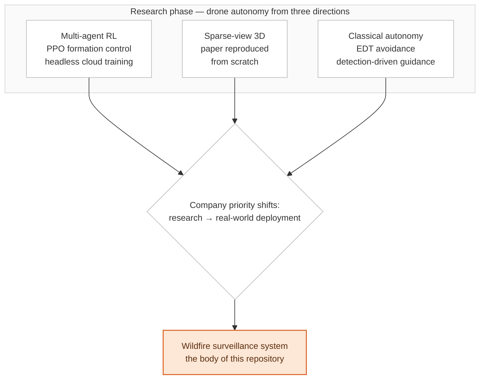

[← Back to overview](../README.md)

# Drone Autonomy — Simulation, Reinforcement Learning and 3D Vision

[Case Study] A year of drone autonomy work: multi-agent RL trained headless in the cloud, a
2025 paper reproduced from scratch, and the classical avoidance and guidance stack alongside
both.

**Language:** English | [한국어](./README.ko.md)

> **🔒 Note on NDA & Proprietary Code:** proprietary source code, internal metrics, client
> identities and site data are omitted. This is a technical case study of approaches,
> trade-offs and decisions. Open-source tools and published papers are named; nothing else is.

---

## What this is

This documents the research-side phase of a drone autonomy role — the year of work that
preceded the [wildfire surveillance program](../README.md) documented in the rest of this
repository.

Three lines of work ran in parallel, approaching autonomy from opposite directions: a **learned**
one (multi-agent RL for formation control), a **perception/reconstruction** one (reproducing a
recent sparse-view 3D method), and a **classical** one (distance-transform avoidance and
detection-driven guidance). None is a product. Together they are a map of the angles from which
the problem was attacked before the focus narrowed.

**Why this line of work ended:** not because it was exhausted. As the company's priority
shifted from research to real-world deployment, this role moved with it — onto the wildfire
surveillance system, where the simulation, detection-drives-control and headless-infrastructure
experience from this phase went directly to work.

---

## Chapters

| # | Chapter | Topics |
| :--- | :--- | :--- |
| 01 | [Multi-Agent RL for Formation Control](./01-multi-agent-rl.md) | PPO on two simulators and two RL stacks, headless parallel training in the cloud, reward-coefficient search as the real problem |
| 02 | [Reproducing a Paper From Scratch](./02-paper-reproduction.md) | Joint pose/geometry/appearance from sparse uncalibrated views, rebuilt in four modules with Gaussian Splatting synthesis |
| 03 | [Avoidance, Guidance and Mission Tooling](./03-avoidance-guidance.md) | Euclidean distance transform for clearance-maximizing headings, detection-triggered intercept guidance, spline and speech-driven mission tooling |

---

## What carried forward

| From this phase | Where it went |
| :--- | :--- |
| Headless simulation, distributed GPU training | The wildfire program's software-in-the-loop verification environment |
| Detection triggering control | Closed-loop gimbal tracking, with the guards this early version lacked |
| Implementing methods from papers rather than running checkpoints | The model survey and the grader rebuild that inverted its leaderboard |
| Depth and geometry work | Rangefinder geolocation and the coverage path planner |

---

> **Status of this document.** This is written from recollection and notes, not from a live
> codebase, and each chapter ends with an explicit list of what it would need to be a stronger
> claim — mostly quantitative results that exist in training logs and checkpoints rather than
> in these pages. That list is deliberately visible: a portfolio that states its own gaps is
> more useful than one that hides them, and everything here should be read as "this is what was
> built and why", not "this is how well it performed".
