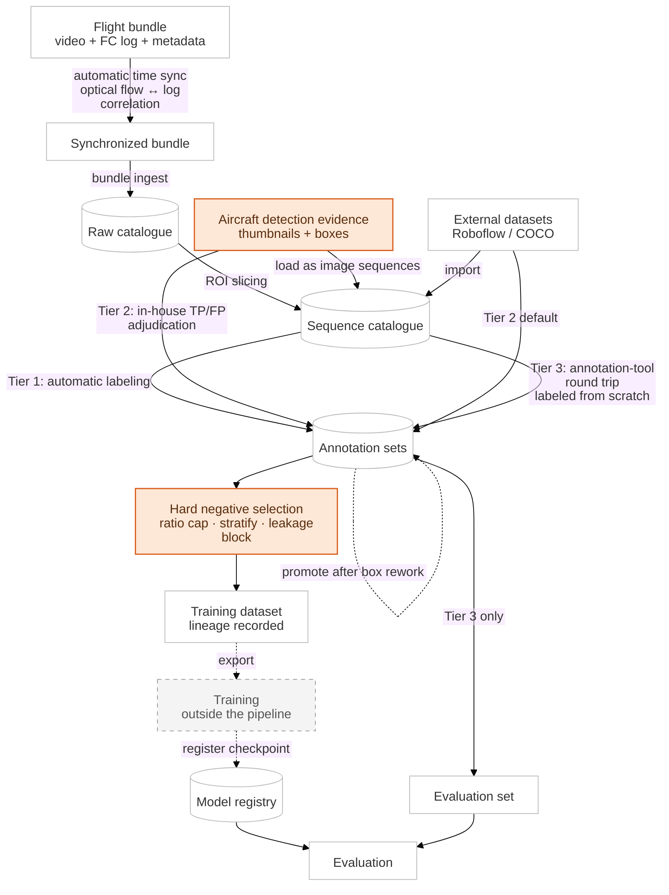

[← Back to overview](../README.md) · **Language:** English | [한국어](./ko/02-data-pipeline.md)

# 02 — Data Pipeline & Annotation

---

## The pipeline

One flight produces one bundle: video, flight-controller log, metadata. The pipeline turns that
bundle into training-ready sequences, labels them, and versions them — automatically.

---

## Customizing the annotation tool

The plan was to use an open-source annotation tool as-is, but distributing work across several
annotators was not efficient in it. The bottleneck was not drawing boxes — it was that every
step *around* drawing boxes was manual: deciding who takes which frames, merging what several
people drew, tracking who drew what. Video labels also have to carry one object across frames
under the same ID, so splitting a clip into per-person segments breaks IDs at every boundary.

Forked it and added the following.

- **Automatic job creation**. Give it a video, a frame interval and a job count, and tasks and
  jobs are generated under the rules below.
- **Work distribution**. Frames are dealt alternately across N jobs rather than cutting the clip
  into segments. (Handing one person a run of consecutive frames creates several inefficiencies.)
- **Shared frames**. Some frames are assigned "in common" to two or more annotators, so labeling
  quality can be judged and maintained.
- **Anchor job**. One person draws reference tracks at the head of the clip and those are copied
  into every job. Everyone starts from the same track IDs, so merging is clean.

The point is not how many frames were labeled. It is that the labeling process was made more
efficient, and what could be automated was automated.

Finally, a dedicated HTML review gallery was built so annotation quality could be audited and
verified quickly.

A **self-hosted MLOps tracking tool** was also deployed.

---

## An annotation automation attempt that failed

- Tried automatic labeling by geometric projection.
- Using aircraft GPS, gimbal attitude and zoom/FOV to project a known smoke position onto the
  image plane.

Result: failed.

- Reason 1: **the attitude stream and the video timestamps were not aligned**.
- Reason 2: once aligned, the geometrically computed bearing was reasonably accurate, but not
  precise enough to use as a label.

Reason 1 is what led to the time-alignment work in
[05 — Sensors, Signal Processing & Time Sync](./05-geometry-sensors.md).

---

## Collecting EO/IR data without a wildfire

Training data for early-stage fire needs early-stage fire, which cannot be ordered and is
illegal to start. So it was substituted: **a frying pan as a controlled heat source for the
thermal channel, smoke grenades for the optical channel.**

Cheap, repeatable, safe and schedulable, which made it a better option than waiting for a real
fire. Much of the early held-out evaluation material came from these sessions, and the benchmark
that decided the model survey ([01](./01-model-selection.md)) rests on them too.

---

## Why field-test records matter

Early on, after every field test someone had to reconstruct which recording belonged to which
test, from memory and timestamps. It took hours every time.

The fix was **a short form the pilot-in-command fills in at the field**, marking the start and
end of each test as it happens (Google Form level).

A heavier tool was evaluated and rejected as not worth the time or cost at that stage. The
judgment required is **knowing which problems deserve engineering and which need one form**. Not
every problem has to be solved with code.

---

**Next:** [03 — Edge Optimization](./03-edge-optimization.md)
