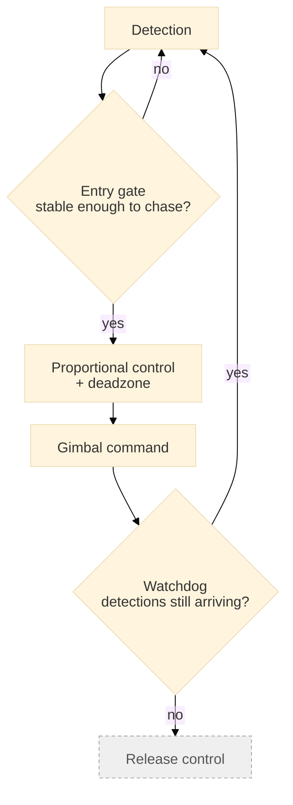

[← Back to overview](../README.md) · **Language:** English | [한국어](./ko/04-realtime-control.md)

# 04 — Real-Time Perception & Control

---

## Detection-driven camera tracking

When fire or smoke is detected, the gimbal is driven automatically so the camera slews onto it
and keeps following.

What the loop actually consumes is the cascade output from [03](./03-edge-optimization.md).

Proportional (P) control, with three guards.

- **Entry gate**: the loop only engages on detections stable enough to be worth chasing (for
  example, sustained for half a second or more).
- **Deadzone**: so the gimbal does not jitter against detector noise near the center.
- **Watchdog**: so a stalled or silent detector cannot leave the camera driving.

---

## The SDK contention bug

**Symptom.** After deployment, gimbal attitude reads began failing intermittently. Camera SDK
response time also slowed by roughly 6×. It slowed even while gimbal tracking was *idle*.

**Analysis.** The camera exposes only a **single control channel**, and the tracking subsystem
was holding that channel even in its idle state.

**Fix.**

1. Gimbal tracking transmits only when there is an actual command.
2. Reads over the camera channel always retry.
3. **Yield to the operator.** Human input always preempts the automatic loop.

**Conclusion.** A subsystem that is logically idle can still be holding a shared resource.
Profiling the *active* path alone does not reveal it.

---

## Splitting the threshold

One detection threshold was serving two incompatible consumers. Operators need a clean screen; a
false alarm every few minutes stops them trusting the system. Model training wants the reverse —
as much evidence as possible including marginal detections, since those are the cases the next
model version has to learn.

The two were split.

- **The strict threshold** decides what reaches the operator's screen and what raises an alarm.
- **The loose threshold** decides what is kept as evidence for future training.

---

## Preserving detection evidence

Saving everything the detector produces accumulates near-duplicate data. It costs CPU, and there
is no reason to feed near-identical snapshots into training twice.
So the edge device judges at save time whether a snapshot is "near-identical" to one already
kept — perceptual hashing, dHash — and declines to store it when it is not needed.

---

**Next:** [05 — Sensors, Signal Processing & Time Sync](./05-geometry-sensors.md)
