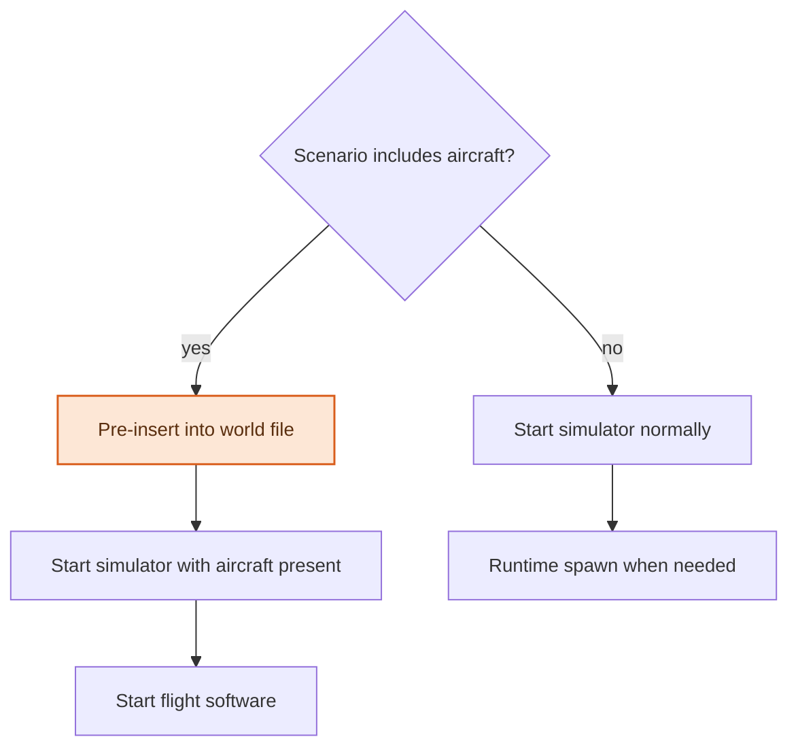
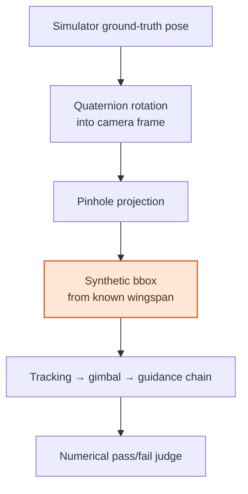

[← Back to overview](../README.md) · **Language:** English | [한국어](./ko/07-simulation-verification.md)

# 07 — Simulation & Verification

> Field tests are expensive, weather-dependent, and require a fire. Most of what needed
> verifying did not actually need either — including, it turned out, the perception model.

---

## Why simulate

Every field test costs a day of travel, a flight window, a pilot, and cooperative weather.
Anything that can be falsified indoors should be. The simulation environment answers three
questions from the desk: does a proposed patrol actually cover the ground it claims to
([05](./05-geometry-sensors.md)), does the control chain ([04](./04-realtime-control.md))
behave correctly, and does the estimator agree with physics.

The flight stack runs software-in-the-loop against a physics simulator, with the same onboard
software that flies the real aircraft.

---

## Verifying coverage against real terrain

The question that most needed simulation was whether **a planned patrol actually covers the
ground it claims to**. Coverage plans are generated against a terrain model
([05](./05-geometry-sensors.md)), and on real terrain — concave ridgelines, occluding spurs,
valleys hidden from one viewpoint and not the next — the difference between a plan that covers
and a plan that merely looks like it covers is invisible until someone flies it. Flying it for
real costs a day. Flying it in simulation costs minutes.

So the environment catalogue grew from one world to seven: mountain, canyon, lakeside, riverside
and wildfire scenes, each with a corresponding terrain model, plus fire and smoke effects and
human models for scene-scale reference. The terrain models are the point — they are what makes
a coverage result mean anything.

Getting there took work that had nothing to do with coverage. Bringing the aircraft up in
simulation at all took **seven distinct fixes**, each a real defect in the integration between
the flight stack, the simulator and the launch tooling, and each one that would have surfaced
eventually on hardware where the debugging loop is hours instead of seconds. The simulator's own
physics needed correcting too, including frame rotation and gimbal sensor orientation: its model
of the aircraft was wrong in ways that would have silently invalidated every test run on top of
it.

**The spawn method was rebuilt.** The original approach started the simulator and then spawned
the aircraft into it, which failed frequently on large models. The replacement **pre-inserts
the aircraft into the world file before the simulator starts**, with the runtime-spawn path
kept as a fallback for cases where pre-insertion is not possible:

A multi-aircraft formation spawn script followed, along with a launcher fix for a bug where a
recently-closed session pushed the next one onto the wrong port.

---

## The synthetic detector

The most useful idea in this chapter: **to verify the tracking → gimbal → guidance chain, you
do not need a perception model at all.**

Instead of running a detector in simulation, take the target's ground-truth pose directly from
the simulator, rotate it into the camera frame via quaternion, project it through a pinhole
camera model, and synthesize a bounding box from the known wingspan.

What this buys:

- **Deterministic control verification.** Failures in the chain are unambiguously control
  failures, because the perception input is exact by construction.
- **The detector becomes a swappable component** rather than a prerequisite. Control work and
  perception work proceed in parallel instead of one blocking the other.
- **A regression baseline that cannot drift**, since synthetic detections are reproducible in a
  way real footage never is.

Alongside it: a ground-truth recorder for comparing simulated physics against the onboard state
estimator, and a numerical pass/fail judge so scenario runs produce verdicts rather than
videos someone has to watch.

A separate flight-path generator produces benchmark trajectories for detect-and-track
evaluation — FOV frustum parameterized, including deliberate exit-and-reenter scenarios, so
that "does the tracker reacquire" is a measured property rather than an anecdote.

The wildfire demonstration scenarios built on this foundation added fixed-camera watchtowers,
patrol flight paths, and coverage-efficiency metrics.

---

## Scoring a tracker with no ground truth

A harder evaluation problem arrived from the hardware side: **how do you compare an in-house
tracking seeker against a vendor's on real field footage, when neither has labeled ground
truth?**

Producing frame-accurate ground truth for enough field recordings to be statistically
meaningful was not affordable. So the framework was designed around the constraint instead of
against it — **scored from video and GPS alone, with no ground-truth labels required**, on a
three-point qualitative scale:

| Component | Design |
| :--- | :--- |
| Flight scenarios | 14 total — 9 hover, 5 with the aircraft moving |
| Gimbal stability protocol | 13 maneuvers, independently scored, using aircraft-mounted markers |
| Scoring basis | Video + GPS only; 1–3 qualitative scale |
| Reliability control | Two-rater consistency check on identical recordings |

The two-rater check is what makes a qualitative scale defensible: without it, a subjective
score is one person's opinion; with it, inter-rater agreement is a measurable property of the
instrument. The framework's purpose was a like-for-like comparison between the in-house seeker
and the vendor's, on footage neither was tuned for.

The underlying principle recurs throughout this project: when the ideal measurement is
unaffordable, design an affordable measurement whose limitations you can state precisely —
rather than either faking the ideal one or measuring nothing.

---

## Simulation ground station

The simulated ground station doubled as the development surface for operator-facing behavior,
and several real defects surfaced there before reaching the field: door controls sticking in a
pending state because a wait flag never cleared, landing confirmation dialogs that persisted
after dismissal, and fire-detection behavior tuning — faster return to standby, rate-limited
detection logging, telemetry-derived positioning, and state reset when standby persists.

Several of those behaviours — door state, landing confirmation, return to standby — belong to
the charging stations in [08](./08-infrastructure.md); they were exercised against a simulated
aircraft long before a real one landed in a real station.

Cheap to find in simulation. Expensive to find at the site, with the aircraft on the pad.

The site is still where the system has to live, though — unattended, on cellular, through
weather. That is what the last engineering chapter is about.

---

**Next:** [08 — Field Infrastructure & Operations](./08-infrastructure.md)
