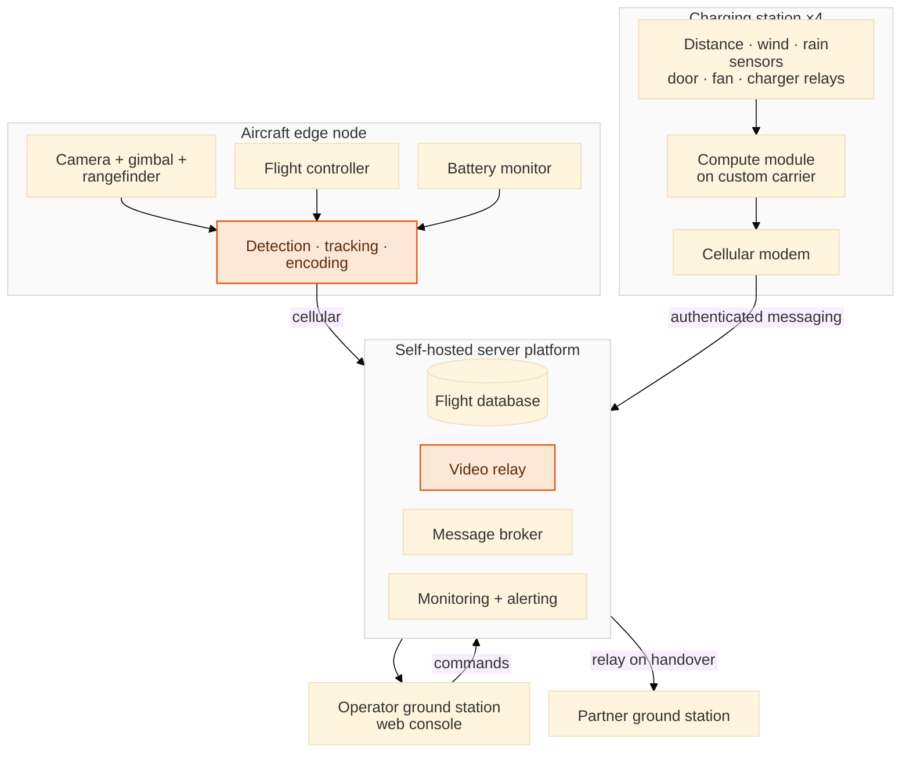

[← Back to overview](../README.md) · **Language:** English | [한국어](./ko/08-infrastructure.md)

# 08 — Field Infrastructure & Operations

> Everything between a working detector and a system that runs unattended outdoors at the test
> site:
> autonomous charging stations, an operator console, a flight database, and a cellular link
> that keeps failing in interesting ways.

---

## System shape

Simulation ([07](./07-simulation-verification.md)) verified the parts one at a time. Deployment
is what happens when all of them run at once, outdoors, for months.

One structural decision: **the aircraft streams only to our server, always.** When control is
handed to an external ground station, the *server* relays onward — insulating the aircraft from
partner-side changes and ending the handover video drops the earlier direct-streaming
arrangement had.

---

## Autonomous charging stations

Four stations operate unattended outdoors at the test site, which means every failure mode has
to be handled
without a person present.

**The controller is a Raspberry Pi compute module on a custom carrier board.** Everything the
station does physically — reading the landing distance sensor, the anemometer and the rain
sensor, driving the door actuator, the cooling fan and the charger relays, and talking to the
cellular modem — runs off that module through its sensor buses and GPIO. This is bare-metal
embedded Linux work rather than application work: bus enumeration, relay state, power
sequencing and unattended boot are the substance of it.

One defect illustrates the class precisely. Sensor buses were being selected **by index** — and
the index differs from unit to unit, so one station spent an extended period silently reading an
empty bus and reporting plausible nonsense. The fix selects by bus *type* and, when the expected
device is absent, **fails loudly instead of returning a value**. On a fleet whose units are not
bit-identical, addressing hardware by enumeration order is a latent failure waiting for the first
unit that enumerates differently.

**Landing detection was rebuilt.** The original pressure-pad sensing drifted per unit and kept
sticking in the "pressed" state, which blocked every door-close operation. It was replaced with
distance sensing — and, more importantly, given an honest **"cannot determine"** state when the
sensor is dead or stalled, instead of guessing.

**Safety is asymmetric, by design.** Opening the door is the safe direction (it prevents
overheating), so an indeterminate state still opens with a warning. Closing the door can strike
an aircraft, so it stays blocked behind an interlock. The asymmetry is the safety model. Both directions were
rehearsed against the simulated ground station ([07](./07-simulation-verification.md)) before
either was trusted with an aircraft.

**A deliberate pre-deployment review found four blocking defects** that testing had not:

| Defect | Why it mattered |
| :--- | :--- |
| Daemon halting itself on first status report | Restart supervision saw it as alive |
| Door state able to stick permanently with no alarm | Silent failure, indefinitely |
| Relay path that could leave a motor running | Physical hazard |
| Periodic routine re-triggering thermal door-open | Fans could never be turned off |

Restart correctness came from the same review: the daemon now **reads actual relay state on
startup** rather than assuming, after a case where it could not turn off a fan it did not know
was running.

**Configuration was unified.** All four stations run one identical program with per-unit
differences (identifiers, ports, credentials) isolated to config files, after a deployment
overwrote one station's locally-patched sensor logic.

**Thresholds were recalibrated against field data rather than intuition.** A rain sensor
threshold turned out to be unreachable across two months of recorded data — it could never have
fired. Landing distance and over-voltage thresholds were corrected the same way.

---

## Fleet provisioning

Aircraft are built from a blank storage card to a working node, and **every bug found during an
install is folded back into the repository**, so the next aircraft inherits the fix rather than
the debugging session. The fleet reached five operational aircraft this way.

Two principles hardened after a bad week:

- **Configuration has exactly one canonical location**, and a single command reports what an
  aircraft is actually running. Field-tuned values that existed only on one airframe were
  promoted to fleet defaults so behavior is consistent and version-controlled.
- **A misconfigured aircraft refuses to start** and names what is missing. Previously it fell
  back to built-in defaults silently — which is how one aircraft ended up publishing video
  under another's identity.

Both changes came directly from incidents where silent fallback produced a system that looked
healthy and was not.

---

## Operator ground station

The ground station was not an off-the-shelf product. It was built in-house and integrated with
the self-hosted server, and it carries real-time monitoring, flight analysis and
flight-controller log analysis. On top of that, the web console accumulated the features flight
operations actually demanded:

- **Server-side session recording** keyed to arm/disarm, with several seconds of pre-roll, so
  video, telemetry, and flight logs are captured server-side even if the operator's browser
  disconnects. Disk space self-manages; a re-arm cancels the stop countdown.
- **Precision GNSS correction injection** to the flight controller, controlled from the console
  without exposing credentials to the browser.
- **Pre-flight check panel** — pilot messages, vibration and estimator health, battery per-cell
  values, link state, last-seen time for offline aircraft.
- **Waypoint mission planner** — click to place waypoints with per-point altitude, drag to
  adjust, optional return-to-launch, upload to the flight controller, clearly labeled as
  *stored, not executing*.
- **Handover made visible**: while an aircraft is on the partner lane, a banner locks gimbal
  controls and states plainly that server recording is unavailable.
- **An identity watchdog** that warns when an aircraft's tunnel port and flight-controller ID
  disagree — catching mis-wired provisioning before it produces confusing data.

Recording correctness got its own attention: motor tests were being auto-recorded as flights,
so they are now recognized and discarded — but the rule is deliberately biased toward
over-recording, because a lost real flight is unrecoverable and a spurious recording is merely
clutter.

A next-generation console prototype went from mockup to working demonstration alongside:
adaptive map/video layout, symmetric aircraft and station cards, dark theme — and two features
that change what the operator can reason about. It **draws the camera's actual ground coverage
footprint on the map**, so "where is the camera looking" becomes a visible area rather than a
heading, and it **accumulates a patrol heatmap** showing which zones have been surveyed
recently. For a surveillance system, coverage-over-time is the metric that matters, and it was
previously invisible.

---

## Building the server platform

The server was not provisioned; it was built, twice, and the second one replaced a vendor
platform the system had been renting.

**It started as a laptop.** The first integration server ran the three drone↔server channels —
**telemetry messaging, video relay, and a flight-control passthrough tunnel** — as Docker
subsystems under one project, and was validated end to end against real traffic from an actual
aircraft rather than a mock. That laptop is where the drone↔server interface was first proven
and then renegotiated against reality.

**Then it became real hardware.** An always-on Ubuntu server was built on a repurposed laptop
(wiped from its previous OS) to host annotation work and the comms stack for the whole team;
a second server followed, with a dedicated public address. Access was private-network-only at
first, widened deliberately rather than by default.

**Then it replaced the incumbent.** Three of four charging stations, and subsequently all of
them, were migrated off the vendor platform onto it — direct authenticated messaging with no
bridge, and fixed remote-access ports that survive reboot. Migration ran from a **one-shot
install script**: enter the station number and a password, and the unit comes up configured.
The old platform was then removed entirely and the codebase rebuilt clean — renamed throughout,
with a rewritten procedure for bootstrapping a device from nothing.

Two properties were treated as acceptance criteria rather than nice-to-haves:

- **Unattended recovery.** Power was pulled without warning, repeatedly, to confirm that every
  service, tunnel and remote login restores itself. The standard the system was held to:
  *power and any internet connection* is enough to get back in.
- **Honest reachability.** Middleboxes on public networks were corrupting plaintext control
  connections for the first ~30 seconds. Rather than mandate a VPN, the ground station now
  serves everything over TLS — removing a dependency instead of adding one.

Where a vendor host's client–server contract could not be changed, a **port-forwarding
container** was placed on that host to route traffic to our platform — adapting to a system that
could not be modified rather than demanding it change.

---

## Two failures that were not where they appeared to be

**Flight telemetry was barely arriving.** Position and velocity were largely absent — the
aircraft had never been asked for those data streams, and frames were being truncated on top of
that. Recovering it meant fixing **seven distinct faults across the aircraft and the server**,
including external exposure, multi-client handling, stream distribution so clients stopped
stealing each other's data, and identifier matching. Any one fix alone would have looked like
no improvement, which is precisely why a symptom this broad needs to be decomposed before it is
attacked.

**A station appeared to be flooding the server** with a status-message volume orders of magnitude beyond anything the stations could plausibly produce.
The station hardware was the obvious suspect and the wrong one: the root cause was a
**republish loop inside the server itself**. It was removed, and station liveness became the
server's responsibility rather than something inferred from message volume. The lesson is the
same one as the telemetry cascade — the component generating the symptom is not reliably the
component causing it.

---

## Flight database and analytics

The flight record store was migrated from a single-file database to **PostgreSQL with zero
downtime**: schema port, backfill of millions of historical records, a dual-write period,
equivalence verification, and live cutover — followed by periodic self-checks comparing both
stores after the switch.

The method is the point: **every query was verified to return identical answers from the new
store before any service was switched to it.** No outage, no loss.

Field data beat theory repeatedly during the migration — empty messages, out-of-spec values,
and a storage-ordering property that could silently reshuffle result order were each found in
production data and encoded into the schema.

The analytics web application built on top of it:

- Recorded sessions (telemetry, flight-controller logs, video) normalize automatically into one
  store and appear in the flight list within seconds of landing.
- **Most of what the review screen shows is computed on view rather than stored**, so past
  flights gain the benefit of new features without reprocessing.
- **One time cursor drives everything** — charts, 2D satellite track, 3D terrain view, and all
  recorded video move together; clicking a chart seeks the video.
- Session verdicts (vibration, battery, temperature, signal, altitude) render as pass/warn/fail
  tiles against agreed thresholds, with event markers for mode changes, GPS state transitions,
  estimator instability, and battery protection cutoffs.
- Frame-level fire detections are **clustered into distinct fire events** and placed on the map.
- The message explorer pre-classifies dozens of message types, and **new fields appear
  automatically** when the aircraft starts sending them — no code change per field.

This store is also the head of the data pipeline: the bundle that appears in the flight list
within seconds of landing is the same bundle [02](./02-data-pipeline.md) turns into labeled
sequences. The observation this repository opens with — that the ceiling was set by data rather
than architecture ([01](./01-model-selection.md)) — is why this end of the system was built to
the standard it was.

Flight-controller black-box logs stream to the onboard computer during flight and forward
themselves to the server after landing, throttled in-flight to protect the video link. Three
subtle corruption bugs were traced to root cause against the flight controller's own source
code before this was trusted.

---

## Connectivity and reliability

**Adaptive bitrate control.** Video was stalling on a roughly 30-second cycle. Root cause: the
carrier's token-bucket policer banks burst credit, so a single throughput sample reads several
times higher than the sustainable rate — and a windowed-maximum estimator latches onto that
inflated figure, driving the target far above what the link can carry, producing heavy
retransmission and multi-second queuing.

The rebuilt controller:

- estimates with a **median** rather than a maximum, ignoring burst outliers while staying
  robust to single dips;
- is **asymmetric** — increases are probe-driven against the current target, decreases are
  congestion-driven with additive-increase/multiplicative-decrease and a cleared estimation
  window so it cannot re-ratchet onto a stale ceiling.

Over a two-hour soak test this took **visible stalls to zero** and cut 95th-percentile queuing
delay by more than an order of magnitude. An offline harness reproduces the whole failure class
**without a drone**, from scripted socket statistics.

**Cellular link failures were diagnosed, not worked around.** Recurring disconnects traced to
the carrier providing an IPv6-only bearer while the modem's internal IPv4 translation stalled
under upload load — proven with both real and synthetic load. A watchdog that detects known
stall signatures turned a 49-minute outage into roughly one minute of self-recovery, and modem
logs now persist across reboot with a snapshot explaining *why* each disconnect happened
(signal collapse, interface stall, or load), so every offline moment is self-documenting.

**Security hardening** ran alongside: encrypted messaging rollout where a device configured for
encryption but missing certificates **fails loudly instead of silently reverting to plaintext**;
key-only remote authentication; per-aircraft read-only credentials; brute-force protection,
verified by actually triggering it. Pre-deployment review of the log upload path found a subtle
configuration hole where a differently-keyed device could bypass upload restrictions and have
filenames executed as commands — closed before deployment, with a regression guard.

---

## Field validation

A field test cleared its four objectives in a single session: recording auto-stop on disarm,
thermal readout at operational altitude, algorithmic tracking with position estimation, and
quadrant thermal min/max logging. A public live demonstration followed, for which
detection-driven camera tracking was implemented specifically.

That is the system as it was deployed. The last chapter goes back to where this started — to
the detector findings that turned out to be about more than wildfires.

---

**Next:** [09 — Research Contributions](./09-research-contributions.md)
