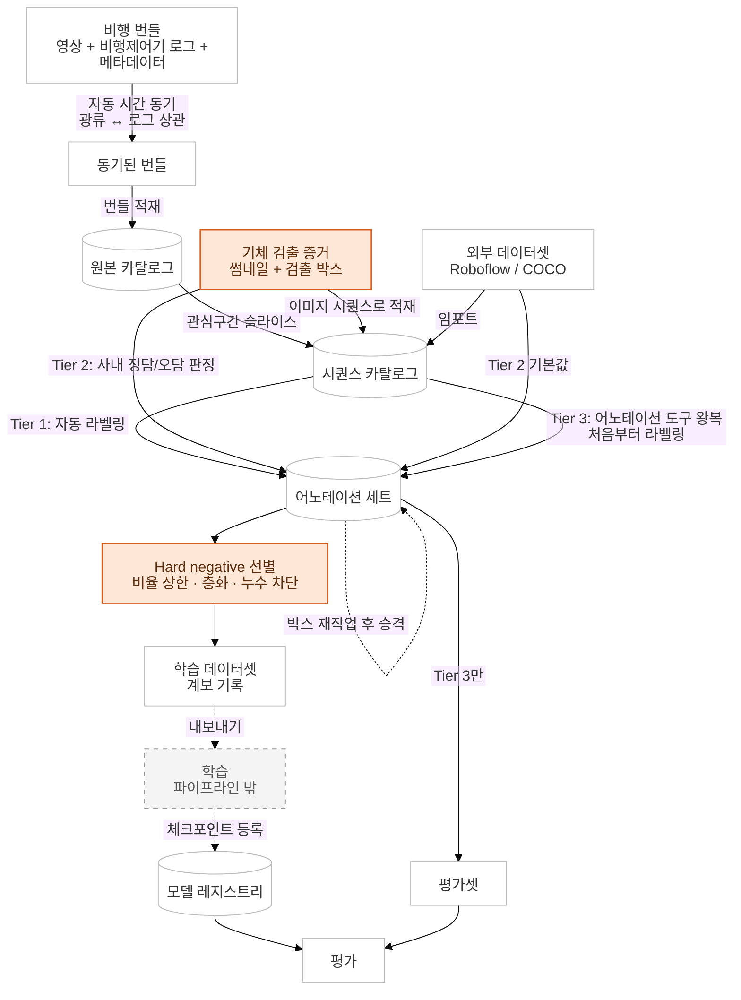

[← 개요로](../../README.ko.md) · **Language:** [English](../02-data-pipeline.md) | 한국어

# 02 — 데이터 파이프라인 & 어노테이션

---

## 파이프라인

비행 한 번이 번들 하나를 만듦. 영상, 비행제어기 로그, 메타데이터가 들어 있음. 파이프라인은 이
번들을 학습에 바로 쓸 수 있는 시퀀스로 만들고, 라벨을 붙이고, 버전까지 관리하도록 자동화함.

---

## 어노테이션 도구 커스터마이징

오픈소스 어노테이션 도구를 그대로 쓰려 했지만 여러 작업자에게 일을 나누는 부분이 효율적이지
않았음. 병목은 박스를 그리는 일이 아니라 그 *주변의* 모든 단계가 수작업이라는 점. 누가 어느
프레임을 맡을지 정하고, 나눠 그린 결과를 하나로 합치고, 어느 프레임을 누가 그렸는지 추적하는 일이
전부 수작업이었음. 게다가 영상 라벨은 한 물체를 여러 프레임에 걸쳐 같은 ID로 이어야 하는데, 구간을
사람별로 잘라 맡기면 구간 경계에서 ID가 끊김.

포크해서 다음을 도입함.

- **작업 자동 생성**. 영상, 프레임 간격, 작업 수를 넣으면 아래 규칙에 맞게 태스크와 작업이 생성됨.
- **작업 분배**. 클립을 구간으로 자르지 않고 프레임을 N개 작업에 번갈아 배정. (연속한 프레임을
  한 사람에게 몰아주는 분배는 여러 비효율을 만듦.)
- **공통 프레임 유지**. 일부 프레임은 "공통"으로 두 명 이상에게 중복 배정. (라벨링 품질을
  판단하고 유지하기 위함.)
- **앵커 작업**. 한 사람이 클립 앞부분에 기준 트랙을 먼저 그리고 이를 모든 작업에 복사. 모두 같은
  트랙 ID에서 시작하므로 합칠 때 문제가 없음.

핵심은 몇 장을 라벨링했느냐가 아니라, 라벨링 과정의 효율을 올리고 자동화할 수 있는 부분을
자동화했다는 것.

마지막으로 전용 HTML 리뷰 갤러리를 구현해, 실제 어노테이션 품질에 대한 감사·검증을 빠르게 진행할
수 있게 함.

또한 **자체 호스팅 MLOps 추적 도구**를 배포함.

---

## 실패한 어노테이션 자동화 예시

- 기하 투영 방식으로 자동 라벨링을 시도.
- 기체 GPS와 짐벌 자세, 줌/화각을 써서 이미 알고 있는 연기 위치를 이미지 평면에 투영하는 방식.

결과: 실패.

- 이유 1: **자세 스트림과 영상 타임스탬프가 정렬되지 않았음**.
- 이유 2: 정렬한 뒤에는 기하로 계산한 방향이 정확한 편이었지만, 라벨로 쓸 만큼 정밀하지는 않았음.

이유 1 때문에 [05 — 센서·신호처리·시간 동기화](./05-geometry-sensors.md)의 시간 정렬 작업을 진행함.

---

## 산불 없이 EO/IR 데이터 수집

초기 화재 학습 데이터를 모으려면 초기 화재가 있어야 하는데, 주문할 수도 없고 직접 내면 불법임.
그래서 **열화상 채널은 프라이팬을 통제된 열원으로, 광학 채널은 연막탄을** 써서 대체함.

싸고 반복 가능하고 안전하며 일정을 잡을 수 있어서, 실제 화재를 기다리는 것보다 나은 방법이었음.
초기 홀드아웃 평가 자료의 상당 부분이 이 세션에서 나왔고, 모델 서베이의 기준이 된
벤치마크([01장](./01-model-selection.md))도 여기에 기반함.

---

## 현장 테스트 기록의 중요성

초기에는 현장 테스트가 끝날 때마다 어느 녹화가 어느 테스트인지를 기억과 타임스탬프로 되짚어야
했음. 매번 몇 시간이 들었음.

해결책은 **현장에서 기장(PIC)이 그때그때 각 테스트의 시작과 끝을 표시하는 짧은 양식**(Google Form
수준).

더 무거운 도구도 검토했지만 그 단계에서는 시간·비용이 아깝다고 판단해 제외. 여기서 필요한 판단은
**어떤 문제가 엔지니어링을 받을 자격이 있고 어떤 문제는 양식 하나면 되는지 아는 것**. 모든 문제를
코딩으로 풀 필요는 없음.

---

**다음:** [03 — 엣지 최적화](./03-edge-optimization.md)
