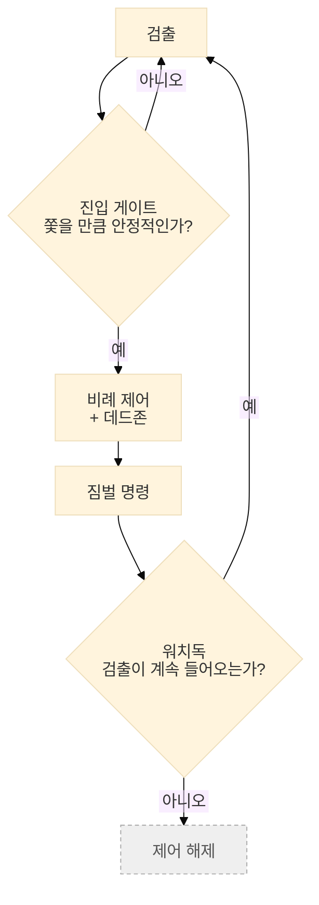

[← 개요로](../../README.ko.md) · **Language:** [English](../04-realtime-control.md) | 한국어

# 04 — 실시간 인지 & 제어

---

## 검출 기반 카메라 추적

불이나 연기가 잡히면 카메라가 그쪽으로 선회해 계속 따라가도록 짐벌을 자동 조작함.

이 루프가 실제로 받아 쓰는 것은 [03장](./03-edge-optimization.md)의 캐스케이드 출력.

비례(P) 제어 + 가드 세 개.

- **진입 게이트**: 쫓을 가치가 있을 만큼 안정된 검출(예: 0.5초 이상 지속)에만 루프가 물림.
- **데드존**: 중심 근처에서 검출기 지터에 맞춰 짐벌이 떨지 않도록.
- **워치독**: 멈췄거나 침묵한 검출기가 카메라를 계속 구동시킬 수 없도록.

---

## SDK contention 버그

**증상.** 배포 후 짐벌 자세 판독이 간헐적으로 실패하기 시작함. 카메라 SDK 응답 시간도 약 6배
느려짐. 짐벌 추적이 *대기 중*일 때도 느려짐.

**분석.** 카메라는 **단일 제어 채널**만 노출하는데, 추적 서브시스템이 대기 상태에서도 그 채널을
붙잡고 있었음.

**수정.**

1. 짐벌 추적 명령은 실제 명령이 있을 때만 전송.
2. 카메라 채널을 통한 읽기는 항상 재시도.
3. **운용자에게 양보.** 사람의 입력은 항상 자동 루프를 선점함.

**결론.** 논리적으로 대기 중인 서브시스템도 물리적으로는 공유 자원을 점유하고 있을 수 있음.
*활성* 경로만 프로파일링해서는 드러나지 않는 문제였음.

---

## 임계값 분리

검출 임계값 하나가 양립 불가능한 두 소비자를 상대하고 있었음. 운용자에게는 깨끗한 화면이 필요함.
몇 분마다 오경보가 뜨면 운용자가 시스템을 신뢰하지 않게 됨. 모델 학습은 반대를 원함. 경계선 검출까지 포함해
증거를 최대한 모으는 쪽이고, 다음 모델 버전이 배워야 하는 것이 바로 그 사례들이기 때문.

둘을 분리함.

- **엄격한 임계값**은 무엇이 운용자 화면에 뜨고 무엇이 경보를 울릴지를 정함.
- **느슨한 임계값**은 무엇을 향후 학습용 증거로 남길지를 정함.

---

## 검출 증거 보존

검출기에서 나오는 증거를 모두 저장하면 비슷한 데이터가 계속 쌓임. CPU에도 부담이 되고, 거의 같은
스냅샷을 중복으로 학습에 쓸 이유도 없음. 그래서 저장하는 단계에서부터 "거의 동일한
스냅샷"인지 판정하고(dHash 지각 해싱) 불필요하면 저장하지 않는 구조를 엣지 디바이스 안에 구축함.

---

**다음:** [05 — 센서 · 신호처리 · 시간 동기화](./05-geometry-sensors.md)
