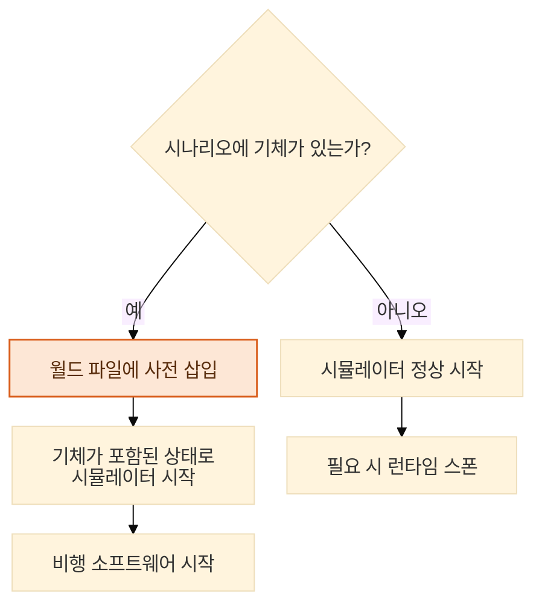
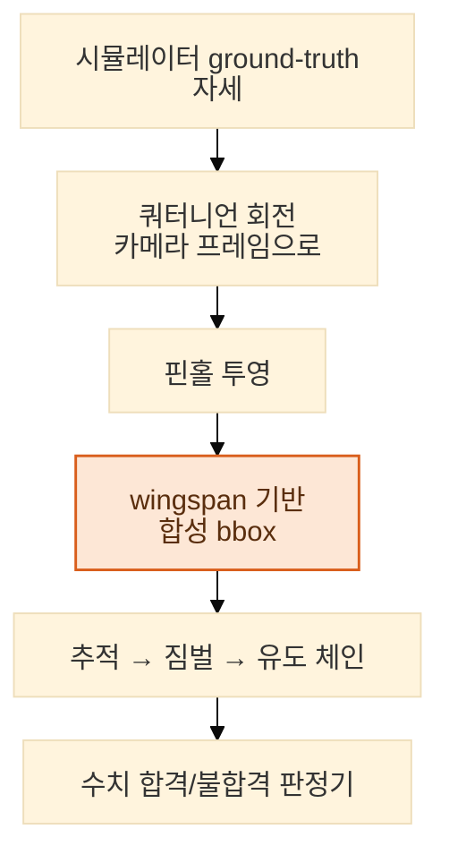

[← 개요로](../../README.ko.md) · **Language:** [English](../07-simulation-verification.md) | 한국어

# 07 — 시뮬레이션 & 검증

> 현장 테스트는 비싸고, 날씨를 타고, 불이 있어야 한다. 그런데 검증할 것 대부분은 사실 둘 다
> 필요 없었다. 알고 보니 인지 모델마저 그랬다.

---

## 왜 시뮬레이션인가

현장 테스트 한 번에 이동 하루와 비행 가능 시간대, 조종사, 그리고 날씨의 협조까지 들어간다. 실내에서
반증할 수 있는 것은 실내에서 반증해야 한다. 그래서 책상을 떠나지 않고 세 가지 질문에 답하려고
시뮬레이션 환경을 만들었다. 계획한 순찰이 주장하는 영역을 실제로
커버하는가([05장](./05-geometry-sensors.md)). 제어 체인([04장](./04-realtime-control.md))이
올바르게 동작하는가. 추정기가 물리와 맞는가.

비행 스택은 물리 시뮬레이터를 상대로 software-in-the-loop으로 돈다. 온보드 소프트웨어는 실제 기체를
띄울 때 쓰는 것과 같다.

---

## 실제 지형 위에서 커버리지 검증하기

시뮬레이션이 가장 필요했던 질문은 **계획한 순찰이 주장하는 영역을 실제로 커버하는가**였다.
커버리지 계획은 지형 모델을 놓고 만든다([05장](./05-geometry-sensors.md)). 그런데 실제 지형은
오목한 능선과 시야를 가리는 지릉, 한 시점에서는 숨고 다음 시점에서는 보이는 골짜기로 이루어져
있다. 진짜 커버하는 계획과 커버하는 것처럼 보이는 계획의 차이는 누가 한 번 날려보기 전까지
드러나지 않는다. 실제로 날리면 하루가 들고, 시뮬레이션에서 날리면 몇 분이 든다.

그래서 환경 카탈로그를 월드 1종에서 7종으로 늘렸다. 산악, 협곡, 호숫가, 강변, 산불 장면을 각각
거기 맞는 지형 모델과 함께 만들었고, 불·연기 효과와 장면 스케일 기준용 사람 모델도 넣었다. 핵심은
지형 모델이다. 커버리지 결과에 의미를 주는 것이 그것이기 때문이다.

거기까지 가는 데는 커버리지와 무관한 작업이 꽤 들었다. 시뮬레이션에서 기체를 띄우는 것만 해도
**서로 다른 수정 7건**이 필요했다. 하나하나가 비행 스택과 시뮬레이터, 런치 도구 사이 통합에 있던
진짜 결함이었고 언젠가는 하드웨어에서 튀어나왔을 것들이다. 하드웨어에서는 디버깅 루프가 초가 아니라
시간 단위다. 시뮬레이터 물리도 직접 손봐야 했다. 프레임 회전과 짐벌 센서 방향이 그랬는데,
시뮬레이터가 가진 기체 모델은 그 위에서 돌린 모든 테스트를 조용히 무효로 만드는 방식으로 틀려
있었다.

**스폰 방식을 다시 만들었다.** 원래는 시뮬레이터를 먼저 띄우고 거기에 기체를 스폰했는데, 모델이 크면
자주 실패했다. 새 방식은 **시뮬레이터가 시작하기 전에 기체를 월드 파일에 미리 넣는다**. 사전 삽입이
불가능한 경우를 위해 런타임 스폰 경로는 폴백으로 남겼다.

이어서 다중 기체 편대 스폰 스크립트를 붙였고, 최근 종료된 세션이 다음 세션을 잘못된 포트로
밀어내던 런처 버그도 함께 고쳤다.

---

## 합성 검출기

이 장에서 가장 유용한 아이디어는 이것이다. **추적 → 짐벌 → 유도 체인을 검증하는 데 인지 모델은
전혀 필요 없다.**

시뮬레이션에서 검출기를 돌리지 않는다. 대신 표적의 ground-truth 자세를 시뮬레이터에서 직접 가져온다.
쿼터니언으로 카메라 프레임에 맞춰 돌리고, 핀홀 카메라 모델로 투영한 다음, 알려진 wingspan으로
바운딩 박스를 합성한다.

이 방식으로 얻는 것은 이렇다.

- **결정론적 제어 검증.** 인지 입력이 구성상 정확하므로, 체인에서 나는 실패는 곧 제어 실패다.
- **검출기가 전제조건이 아니라 교체 가능한 부품이 된다.** 제어 작업과 인지 작업이 서로를 막지 않고
  병렬로 진행된다.
- **드리프트할 수 없는 회귀 기준선.** 합성 검출은 실제 영상이 결코 따라올 수 없을 만큼 그대로 재현된다.

여기에 더 붙인 것이 있다. 시뮬레이션 물리와 온보드 상태 추정기를 비교하는 ground-truth 레코더,
그리고 수치 합격/불합격 판정기다. 판정기가 있으니 시나리오 실행은 누군가 앉아서 봐야 하는 영상이
아니라 판정을 내놓는다.

별도의 비행경로 생성기가 검출-추적 평가용 벤치마크 궤적을 만든다. FOV frustum을 파라미터로 두고,
의도적인 이탈-재진입 시나리오도 넣는다. 그래야 "트래커가 재획득하는가"가 일화가 아니라 측정된 속성이
된다.

산불 시연 시나리오는 이 토대 위에 올렸다. 고정 카메라 관제탑, 순찰 비행 경로, 커버리지 효율 지표를
여기에 더했다.

---

## 정답 라벨 없이 트래커를 채점하기

하드웨어 쪽에서는 더 어려운 평가 문제가 왔다. **정답 라벨이 없는 실제 현장 영상에서, 자체 추적
시커와 업체 시커를 어떻게 비교하는가?**

통계적으로 의미가 있을 만큼 현장 녹화본을 모아 프레임 단위 정답을 다는 일은 감당할 수 없었다. 그래서
제약에 맞서는 대신 제약을 중심에 두고 프레임워크를 설계했다. **영상과 GPS만으로 채점하고 정답 라벨은
전혀 쓰지 않는** 3점 정성 척도다.

| 구성 요소 | 설계 |
| :--- | :--- |
| 비행 시나리오 | 총 14종 — 호버 9종, 기체 이동 5종 |
| 짐벌 안정성 프로토콜 | 기체 부착 마커를 이용한 13개 기동, 독립적으로 채점 |
| 채점 근거 | 영상 + GPS만; 1~3점 정성 척도 |
| 신뢰도 통제 | 동일 녹화본에 대한 평가자 2인 일관성 검사 |

정성 척도를 방어할 수 있게 만드는 것이 바로 평가자 2인 검사다. 없으면 주관적 점수는 한 사람의
의견에 그친다. 있으면 평가자 간 일치도가 측정 도구의 측정 가능한 속성이 된다. 프레임워크의 목적은
양쪽 모두 튜닝하지 않은 영상에서 자체 시커와 업체 시커를 같은 조건으로 비교하는 것이었다.

이 프로젝트 전반에 되풀이되는 원칙이 여기 있다. 이상적인 측정을 감당할 수 없을 때, 어설프게 흉내
내거나 아예 측정을 포기하는 대신 **한계를 정확히 말할 수 있는, 감당 가능한 측정을
설계한다.**

---

## 시뮬레이션 지상국

시뮬레이션 지상국은 운용자 대면 동작을 개발하는 표면 역할도 겸했다. 실제 결함 여럿이 현장에 닿기
전에 여기서 먼저 드러났다. 대기 플래그가 해제되지 않아 "동작 중" 상태에 고착되던 문 제어, 닫은
뒤에도 남아 있던 착륙 확인 안내창이 그랬다. 화재 감지 동작도 여기서 튜닝했다. 더 빠른 대기 복귀,
감지 로그 빈도 제한, 텔레메트리 기반 위치 산출, 대기 상태가 이어질 때의 초기화까지.

문 상태, 착륙 확인, 대기 복귀는 [08장](./08-infrastructure.md)의 충전 스테이션에 속한 동작이다.
실제 기체가 실제 스테이션에 내려앉기 한참 전에 가상 기체를 상대로 먼저
검증했다.

시뮬레이션에서 찾으면 싸다. 기체를 패드에 올려놓고 현장에서 찾으면 비싸다.

그래도 시스템이 실제로 살아야 하는 곳은 현장이다. 무인으로, 셀룰러로, 날씨를 견디면서.
마지막 엔지니어링 장이 그 이야기다.

---

**다음:** [08 — 현장 인프라 & 운영](./08-infrastructure.md)
