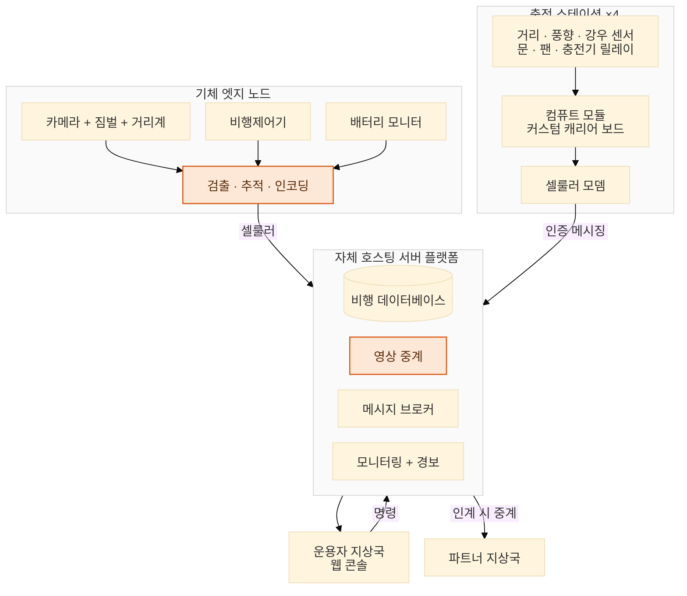

[← 개요로](../../README.ko.md) · **Language:** [English](../08-infrastructure.md) | 한국어

# 08 — 현장 인프라 & 운영

> 동작하는 검출기와, 테스트 사이트 야외에서 무인으로 돌아가는 시스템 사이에 있는 모든 것.
> 자율 충전 스테이션, 운용자 콘솔, 비행 데이터베이스, 그리고 흥미로운 방식으로 계속 실패하는
> 셀룰러 링크.

---

## 시스템 형태

시뮬레이션([07장](./07-simulation-verification.md))은 부품을 하나씩 검증한다. 그 부품들이 야외에서
한꺼번에, 몇 달 동안 돌아갈 때 벌어지는 일이 배포다.

짚어둘 구조적 결정이 있다. **기체는 항상 우리 서버로만 스트리밍한다.** 제어권이 외부 지상국으로
넘어가면 *서버*가 그쪽으로 중계한다. 덕분에 기체는 파트너 쪽 변경에 휘둘리지 않고, 인계 시점에
영상이 더 이상 끊기지 않는다. 이전의 직접 스트리밍 방식이 안고 있던 문제다.

---

## 자율 충전 스테이션

네 기의 스테이션이 테스트 사이트 야외에서 무인으로 돈다. 그래서 모든 실패 모드를 사람 없이
처리해야 한다.

**제어기는 커스텀 캐리어 보드 위의 Raspberry Pi 컴퓨트 모듈이다.** 스테이션이 물리적으로 하는
일은 전부 그 모듈의 센서 버스와 GPIO를 거친다. 착륙 거리 센서·풍향풍속계·강우 센서 판독, 문
액추에이터·냉각 팬·충전기 릴레이 구동, 셀룰러 모뎀 통신이 다 그렇다. 애플리케이션 작업이 아니라
베어메탈 임베디드 리눅스 작업이고, 버스 열거·릴레이 상태·전원 시퀀싱·무인 부팅이 그 실체다.

한 결함이 이 부류를 정확히 보여준다. 센서 버스를 **번호로** 고르고 있었는데, 그 번호가 유닛마다
다르다. 그래서 한 스테이션은 상당 기간 빈 버스를 조용히 읽으며 그럴듯한 헛값을 보고했다. 고치면서
버스 *종류*로 선택하게 바꿨고, 기대한 장치가 없으면 **값을 반환하는 대신 큰 소리로 실패**하게 했다.
유닛이 비트 단위로 똑같지 않은 기단에서 하드웨어를 열거 순서로 지정하면, 다르게 열거되는 첫 유닛이
나타날 때까지 기다리는 잠재 실패를 안고 가는 셈이다.

**착륙 감지를 다시 만들었다.** 원래의 압력 패드 감지는 유닛마다 값이 흐르고 "눌림" 상태에 계속
고착됐고, 그 바람에 문 닫기 동작이 전부 막혔다. 거리 센서로 바꿨다. 더 중요한 것은, 센서가 죽거나
멈췄을 때 값을 추측하는 대신 **"판단 불가"라는 정직한 상태**를 내놓게 한 것이다.

**안전은 설계상 비대칭이다.** 문을 여는 쪽은 안전한 방향이다. 과열을 막기 때문이다. 그래서 판단 불가
상태에서도 경고를 띄우고 연다. 문을 닫는 쪽은 기체와 부딪칠 수 있어서 인터록 뒤에서 계속 막는다.
이 비대칭성 자체가 안전 모델이다. 두 방향 모두 실제 기체를 맡기기
전에 시뮬레이션 지상국([07장](./07-simulation-verification.md))에서 먼저 연습했다.

**배포 전 의도적 검토에서 테스트가 못 잡은 치명적 결함 네 건**이 나왔다.

| 결함 | 왜 문제였나 |
| :--- | :--- |
| 첫 상태 보고에서 데몬이 스스로 멈춤 | 재시작 감독 시스템에는 살아 있는 것으로 보임 |
| 문 상태가 경보 없이 영구 고착 가능 | 무기한 조용한 실패 |
| 릴레이가 모터를 계속 돌린 채 남을 수 있는 경로 | 물리적 위험 |
| 주기 루틴이 과열 문 열림을 계속 재발동 | 팬을 영영 끌 수 없음 |

같은 검토에서 재시작 정확성도 나왔다. 데몬은 이제 시작할 때 **실제 릴레이 상태를 읽는다**. 켜져 있는
줄 몰랐던 팬을 끄지 못한 사례를 겪고 나서, 가정하는 것을 그만뒀다.

**설정을 통일했다.** 네 스테이션 모두 똑같은 프로그램 하나를 돌리고, 유닛별 차이는 설정 파일로 뺐다.
식별자, 포트, 인증 정보가 거기 들어간다. 배포가 한 스테이션의 로컬 패치를 덮어쓴 사건을 겪고 내린
조치다.

**임계값은 직관이 아니라 현장 데이터로 다시 잡았다.** 강우 센서 임계값은 두 달치 기록을 놓고 보니
아예 도달할 수 없는 값이었다. 애초에 울릴 수가 없었다. 착륙 거리와 과전압 임계값도 같은 방식으로
바로잡았다.

---

## 기체 프로비저닝

기체는 빈 저장 카드에서 시작해 동작하는 노드까지 올라간다. **설치 중 발견한 버그는 모두 저장소에
반영하므로**, 다음 기체는 디버깅 과정이 아니라 수정본을 물려받는다. 이렇게 운용 기체 5대까지 왔다.

힘든 한 주를 겪고 원칙 둘이 굳었다.

- **설정의 정본 위치는 정확히 하나**다. 명령 하나면 기체가 실제로 무엇을 돌리는지 확인할 수 있다.
  한 기체에만 있던 현장 튜닝값은 기단 공통 기본값으로 올려서, 동작이 일관되고 버전 관리도 된다.
- **설정이 잘못된 기체는 시작을 거부하고** 무엇이 빠졌는지 말한다. 이전에는 조용히 내장 기본값으로
  돌아갔다. 그래서 한 기체가 다른 기체의 이름으로 영상을 올리는 일이 벌어졌다.

두 변경 모두 실제 사건에서 바로 나왔다. 조용한 폴백이 "건강해 보이지만 실제로는 아닌" 시스템을
만들어낸 사건들이다.

---

## 운용자 지상국

지상국(GCS)은 기성 솔루션을 가져다 쓴 것이 아니라 직접 만들었고, 자체 호스팅 서버와 연동했다.
여기에 실시간 모니터링, 비행 분석, 비행제어기 로그 분석을 모두 올렸다. 웹 콘솔에는 그 위에 비행
운용이 실제로 요구한 기능들이 쌓였다.

- **서버 측 세션 녹화**가 시동/해제에 연동되며 수 초의 프리롤을 포함한다. 운용자 브라우저가 끊겨도
  영상·텔레메트리·비행 로그가 서버에 남는다. 디스크 공간은 알아서 관리하고, 재시동하면 정지
  카운트다운을 취소한다.
- **정밀 GNSS 보정 주입**은 비행제어기로 흘려보내되 콘솔에서 제어하고, 인증 정보는 브라우저에
  노출하지 않는다.
- **비행 전 점검 패널** — 조종사 메시지, 진동 및 추정기 상태, 셀별 배터리 값, 링크 상태, 오프라인
  기체의 마지막 접속 시각.
- **경유점 미션 플래너** — 클릭으로 고도별 경유점 배치, 드래그로 조정, 선택적 RTL, 비행제어기로
  업로드, 그리고 *저장됨, 실행 아님*이라는 명확한 표시.
- **인계를 눈에 보이게**: 기체가 파트너 레인에 있는 동안 배너가 짐벌 조작을 잠그고 서버 녹화가
  불가함을 분명히 알린다.
- **식별 워치독**이 기체의 터널 포트와 비행제어기 ID가 어긋나면 경고한다. 잘못 배선된 프로비저닝이
  혼란스러운 데이터를 만들기 전에 잡아낸다.

녹화 정확성도 따로 손봤다. 모터 테스트가 비행으로 자동 녹화되고 있어서, 이제는 알아보고 버린다.
다만 규칙은 일부러 과녹화 쪽으로 기울였다. 잃어버린 진짜 비행은 되살릴 수 없지만, 쓸데없는 녹화는
그저 잡동사니이기 때문이다.

차세대 콘솔 프로토타입도 목업에서 동작 데모까지 진행했다. 적응형 지도/영상 배치, 대칭적인
기체·스테이션 카드, 다크 테마가 들어갔고, 운용자가 추론할 수 있는 대상 자체를 바꾸는 기능도 둘
붙었다. **카메라의 실제 지상 촬영 범위를 지도에 그려서** "카메라가 어디를 보고 있나"를 방향이 아니라
면적으로 만들었다. 그리고 최근 어느 구역을 감시했는지 보여주는 **순찰 히트맵을 누적**한다. 감시
시스템에서 정말 중요한 지표는 시간에 걸친 커버리지인데, 이전에는 그게 보이지 않았다.

---

## 서버 플랫폼 구축

서버는 프로비저닝한 게 아니라 두 번 만들었다. 두 번째 서버가 이 시스템이 빌려 쓰던 벤더 플랫폼을
대체했다.

**노트북에서 시작했다.** 첫 통합 서버는 드론↔서버 3개 채널을 한 프로젝트 아래 Docker 서브시스템으로
돌렸다. **텔레메트리 메시징, 영상 중계, 비행제어 패스스루 터널**이다. 검증은 목업이 아니라 실제
기체에서 나온 트래픽으로 엔드투엔드로 했다. 드론↔서버 인터페이스를 처음 입증하고 현실에 맞춰 다시
맞춘 곳이 그 노트북이다.

**그다음 실제 하드웨어가 됐다.** 용도를 바꾼 노트북에 기존 OS를 밀고 상시 가동 Ubuntu 서버를 올려,
팀 전체의 어노테이션 작업과 통신 스택을 호스팅했다. 이어서 전용 공인 주소를 가진 두 번째 서버를
세웠다. 접근은 처음엔 사설망 전용이었고, 기본값으로 열린 게 아니라 의도적으로 넓혔다.

**그다음 기존 플랫폼을 대체했다.** 충전 스테이션 4대 중 3대를, 이후 전부를 벤더 플랫폼에서 이쪽으로
옮겼다. 브리지 없는 직접 인증 메시징, 재부팅 후에도 유지되는 고정 원격 접속 포트가 따라왔다. 이전은
**원샷 설치 스크립트**로 진행했다. 스테이션 번호와 비밀번호만 넣으면 유닛이 구성된 상태로 올라온다.
이후 기존 플랫폼을 완전히 걷어내고 코드베이스를 깨끗하게 다시 세웠다. 전체 이름 변경과, 아무것도
없는 상태에서 장치를 부팅하는 절차서 재작성까지 했다.

두 가지 속성은 있으면 좋은 것이 아니라 인수 기준으로 다뤘다.

- **무인 복구.** 예고 없이 전원을 반복해서 뽑아, 모든 서비스·터널·원격 로그인이 스스로 복구되는지
  확인했다. 시스템에 요구한 기준은 이것이다. *전원과 아무 인터넷 연결*만 있으면 다시 들어갈 수 있을 것.
- **정직한 접근성.** 공용망의 중간 장비가 평문 제어 연결을 처음 30초가량 훼손하고 있었다. VPN을
  의무화하는 대신 지상국이 모든 것을 TLS로 제공하게 했다. 의존성을 더한 게 아니라 없앤 것이다.

벤더 호스트의 클라이언트–서버 계약을 바꿀 수 없을 때는 그 호스트에 **포트 포워딩 컨테이너**를
올려 트래픽을 우리 플랫폼으로 보냈다. 바꿀 수 없는 시스템에 바꾸라고 요구하는 대신 이쪽이 맞춘 것이다.

---

## 보이는 곳에 원인이 없던 장애 둘

**비행 텔레메트리가 거의 오지 않고 있었다.** 위치와 속도가 대부분 비어 있었다. 애초에 기체에
그 데이터 스트림을 요청한 적이 없었고, 거기에 더해 프레임까지 잘리고 있었다. 되살리려면 **기체와
서버에 걸친 서로 다른 결함 7건**을 고쳐야 했다. 외부 노출, 다중 클라이언트 처리, 클라이언트끼리
데이터를 뺏지 않게 하는 스트림 분배, 식별자 매칭까지. 어느 하나만 고쳐서는 전혀 나아지지 않은
것처럼 보였을 것이다. 이렇게 넓은 증상을 덤비기 전에 먼저 분해해야 하는 이유가 바로 이것이다.

**한 스테이션이 서버에 상태 메시지를 쏟아붓는 것처럼 보였다.** 스테이션이 도저히 만들어낼 수 없는
규모였다. 스테이션 하드웨어가 명백한 용의자였지만 틀렸다. 근본 원인은 **서버 자체의 재발행
루프**였다. 루프를 걷어냈고, 스테이션 생존 여부는 메시지 양으로 추론하는 대신 서버가 관리하게 됐다.
교훈은 위의 텔레메트리 연쇄와 같다. 증상을 만들어내는 컴포넌트가 원인인 컴포넌트라는 보장은 없다.

---

## 비행 데이터베이스와 분석

비행 기록 저장소를 단일 파일 데이터베이스에서 **PostgreSQL로 무중단 이전**했다. 스키마 이식, 수백만
건 과거 기록 백필, 양쪽 동시 기록 기간, 동일성 검증, 실시간 전환까지 거쳤다. 전환 이후에도 주기적인
자체 점검이 두 저장소를 계속 비교한다.

방법 자체가 핵심이다. **어떤 서비스든 새 저장소로 전환하기 전에, 모든 조회가 같은 답을 내는지
검증했다.** 중단도 유실도 없었다.

이전 과정에서 현장 데이터가 이론을 거듭 이겼다. 빈 메시지, 규격 밖의 값, 결과 순서를 조용히 뒤섞을
수 있는 저장 순서 특성을 각각 실제 데이터에서 발견해 스키마와 코드에 반영했다.

그 위에 올린 분석 웹앱은 이렇다.

- 녹화 세션(텔레메트리, 비행제어기 로그, 영상)이 하나의 저장소로 자동 정규화되고, 착륙 후 수 초 내
  비행 목록에 올라온다.
- **리뷰 화면에 보이는 것 대부분은 저장이 아니라 볼 때마다 계산된다.** 덕분에 과거 비행도 재처리
  없이 새 기능의 혜택을 받는다.
- **시간 커서 하나가 전부를 움직인다.** 차트, 2D 위성 궤적, 3D 지형 뷰, 모든 녹화 영상이 함께
  이동하고, 차트를 클릭하면 영상이 그 시점으로 간다.
- 세션 판정(진동, 배터리, 온도, 신호, 고도)은 합의된 기준에 따라 통과/경고/위험 타일로 그려지고,
  비행 모드 변경·GPS 상태 전이·추정기 불안정·배터리 보호 차단에는 이벤트 마커가 붙는다.
- 프레임 단위 화재 검출은 **개별 화재 이벤트로 묶여** 지도에 올라간다.
- 메시지 탐색기가 수십 종을 미리 분류해두고, 기체가 새 필드를 보내기 시작하면 **자동으로 나타난다**.
  필드마다 코드를 고칠 필요가 없다.

이 저장소는 데이터 파이프라인의 머리이기도 하다. 착륙 몇 초 뒤 비행 목록에 올라오는 그 번들이
바로 [02장](./02-data-pipeline.md)이 라벨링된 시퀀스로 바꾸는 번들이다. 시스템의 이쪽 끝을 이
수준으로 만든 이유는 이 문서가 첫머리에 꺼낸 관찰에 있다. 천장을 정한 것은 아키텍처가 아니라
데이터였다는 것([01장](./01-model-selection.md)).

비행제어기 블랙박스 로그는 비행 중에 온보드 컴퓨터로 흘러가고, 착륙 후에는 스스로 서버로 넘어간다.
비행 중에는 영상 링크를 보호하려고 전송량을 조절한다. 이 경로를 신뢰하기 전에, 미묘한 데이터 손상
버그 세 건을 비행제어기 자체 소스 코드까지 파고들어 근본 원인으로 확인했다.

---

## 연결성과 신뢰성

**적응형 비트레이트 제어.** 영상이 약 30초 주기로 끊기고 있었다. 근본 원인은 이렇다. 통신사의
토큰버킷 policer가 버스트 크레딧을 쌓아두는 탓에, 단일 처리량 샘플이 지속 가능한 속도의 몇 배로
읽힌다. windowed-max 추정기는 그 부풀려진 수치를 붙잡고 목표치를 링크가 감당할 수 있는 수준보다
훨씬 위로 끌어올린다. 그 결과가 대량 재전송과 수 초짜리 큐잉이다.

다시 만든 컨트롤러는 이렇다.

- 최대값이 아니라 **중앙값**으로 추정해, 버스트 이상치는 무시하되 단일 하락에는 강건하다.
- **비대칭적이다.** 상승은 현재 목표치를 기준으로 probe가 끌고, 하강은 혼잡이 끄는 AIMD다. 여기에
  추정 윈도우 초기화까지 넣어서, 방금 벗어난 낡은 천장으로 다시 래칫되지 않는다.

2시간 소크 테스트에서 **가시적 스톨이 0이 되었고**, 95백분위 큐잉 지연이 자릿수 하나 이상 줄었다.
오프라인 하네스가 스크립트된 소켓 통계만으로 **드론 없이** 이 실패 부류 전체를 재현한다.

**셀룰러 링크 장애는 우회하지 않고 진단했다.** 반복되던 끊김은 통신사가 IPv6 전용 베어러를 주는
가운데 모뎀 내부 IPv4 변환이 업로드 부하에서 멈추는 데서 왔다. 실제 부하와 인공 부하 양쪽으로
입증했다. 알려진 멈춤 시그니처를 감지하는 워치독이 49분짜리 중단을 약 1분의 자가 복구로 바꿨다.
모뎀 로그는 재부팅 후에도 남고, 각 끊김이 *왜* 일어났는지를 신호 급락·인터페이스 멈춤·부하 중
무엇인지까지 스냅샷과 함께 기록한다. 덕분에 모든 오프라인 순간이 스스로를 설명한다.

**보안 강화**도 나란히 갔다. 메시징 암호화를 롤아웃하면서, 암호화가 설정됐는데 인증서가 없는 장치는
**조용히 평문으로 되돌아가지 않고 명확히 실패하도록** 했다. 키 전용 원격 인증, 기체별 읽기 전용
자격증명, 그리고 실제로 발동시켜 검증한 무차별 대입 방어도 함께 붙였다. 로그 업로드 경로를 배포
전에 검토하다가 미묘한 설정 구멍을 찾았다. 다른 키를 가진 장치가 업로드 제한을 우회하고 파일명이
명령으로 실행될 수 있었다. 배포 전에 막았고 회귀 방지 장치를 뒀다.

---

## 현장 검증

현장 테스트 한 번에 네 가지 목표를 모두 통과했다. 시동 해제 시 녹화 자동 정지, 운용 고도에서의
열화상 판독, 알고리즘 기반 추적과 위치 추정, 열화상 4분할 최대/최소 기록이다. 이후 공개 라이브
시연이 이어졌고, 거기에 맞춰 검출 기반 카메라 추적을 따로 구현했다.

여기까지가 배포된 그대로의 시스템이다. 마지막 장은 출발점으로 돌아간다. 산불을 넘어서는 이야기였다고
밝혀진 검출기 발견들로.

---

**다음:** [09 — 연구 기여](./09-research-contributions.md)
